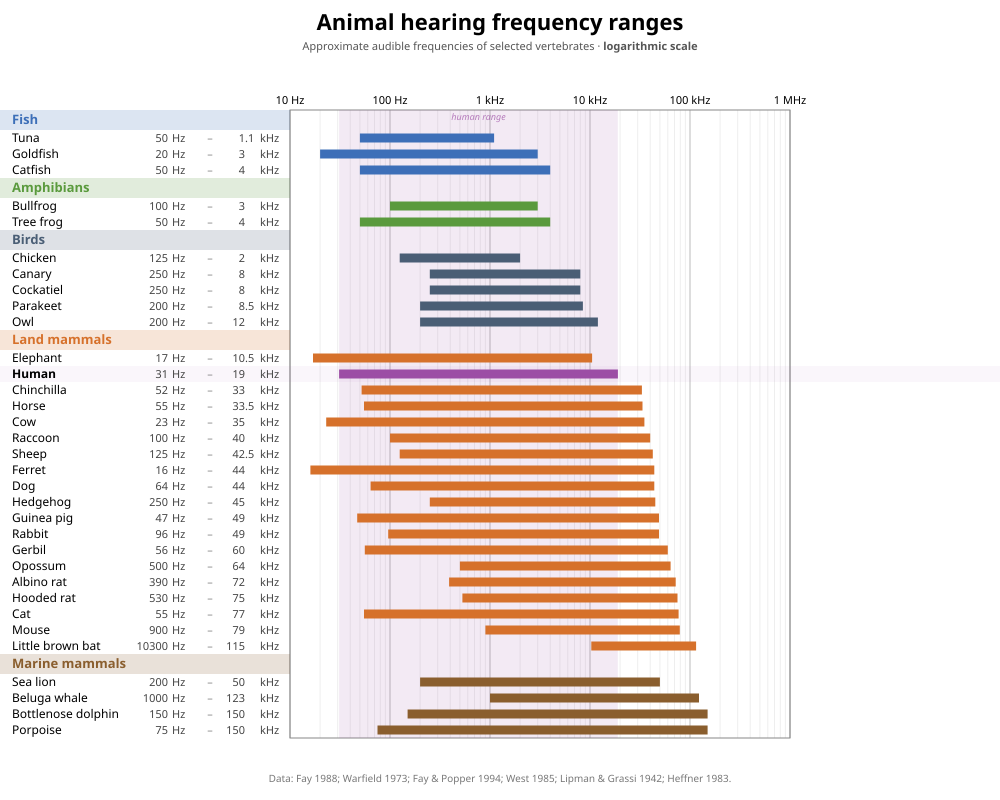

# Sessie 6: audiologie

Tot nu toe hebben we Python-programma's geschreven voor het doorzoeken van data, het maken van berekeningen en het opstellen en simuleren van modellen. In deze sessie schrijven we een Python-programma voor het uitvoeren van een diagnostische test. Zo'n test zouden we ook met de hand kunnen uitvoeren, maar door hem te automatiseren wordt hij sneller, nauwkeuriger en betrouwbaarder. Natuurlijk kost het schrijven van een Python-programma tijd, maar daarna kunnen we hem wel steeds opnieuw gebruiken. 

!!! info "Aansluiting MNW-programma"

    In deze sessie ontwikkelen we een programma voor een eenvoudige hoortest. Daarmee sluit de sessie aan bij het vak _Natuurkunde en gezondheid_ (jaar 1, periode 5), waarbinnen onder andere het vakgebied audiologie aan bod komt. Audiologie richt zich op het gehoor en op gehoorproblemen. Een hoortest is één van de methoden om het gehoor te onderzoeken.
    
## Van sinusgolf naar geluid     

Voor een hoortest hebben we geluid nodig. Geluid is een trilling die zich voortplant als een golf door de lucht. Onderstaand figuur[^giancoli] laat zien hoe een enkele toon zich voortplant als longitudinale golf (a). Een enkele toon is wiskundig te beschrijven als een sinusgolf (b): een periodieke trilling met een vaste frequentie. De frequentie bepaalt de toonhoogte en wordt uitgedrukt in hertz (Hz). Een menselijk oor is gevoelig voor frequenties tussen de 20 Hz en 20000 Hz, hoewel dit per persoon verschilt. Door ouderdom wordt het bijvoorbeeld lastiger om hoge frequenties te horen.

{: style="width:75%"}

[^giancoli]: Douglas C. Giancoli. _Physics: principles with applications_. 6de ed. Upper Saddle River, New Jersy: Pearson Education, 2005.

We kunnen zelf een sinusgolf genereren en deze met de Python-module `sounddevice` afspelen. De basisstructuur van zo'n programma ziet er als volgt uit: 
```py
import sounddevice as sd

# create a sine wave
# store the sine wave values in a list called values
...

# play the tone and wait until it has finished
sd.play(values, samplerate=44100)
sd.wait()
```
Eerst importeren we de module. Daarna maken we een lijst aan met de waarden van de sinusgolf (dit deel programmeer je later zelf). Met `sd.play()` spelen we de toon af. We geven daarbij de lijst met de waarden van de sinusgolf en een bemonsteringsfrequentie (Engels: sample rate) mee. De bemonsteringsfrequentie geeft aan hoeveel waarden per seconde worden gebruikt bij het afspelen van het signaal. Wij gebruiken een bemonsteringsfrequentie van 44100 Hz, wat een standaardwaarde is in audio. De duur van de toon hangt af van de lengte van de lijst. Bij een bemonsteringsfrequentie van 44100 Hz en een lijst van 44100 elementen duurt de toon precies één seconde. Tot slot zorgt `sd.wait()` ervoor dat het programma wacht totdat de toon volledig is afgespeeld, voordat het verdergaat.

!!! warning "Gebruik een koptelefoon"

    Gebruik tijdens deze sessie een koptelefoon. Zo voorkom je dat verschillende geluiden in het lokaal elkaar verstoren. Bovendien kan een koptelefoon lage frequenties, en soms ook hoge frequenties, meestal beter afspelen dan de ingebouwde luidsprekers van een laptop. Daardoor kun je de grenzen van je gehoor beter bepalen. Houd er wel rekening mee dat ook koptelefoons een beperkt frequentiebereik kunnen hebben. Als je een lage of hoge toon niet hoort, ligt dat mogelijk aan de koptelefoon.

!!! opdracht-basis "Module `sounddevice` installeren"

    Om de module `sounddevice` te kunnen gebruiken, moet je deze eerst installeren in de virtuele omgeving. Open in Visual Studio Code een terminal via het dropdownmenu **Terminal** en kies **New Terminal**. Installeer vervolgens de module met:
    ```
    uv pip install sounddevice
    ```
    
!!! opdracht-basis "Toon afspelen"

    Je schrijft een programma dat een toon van 1000 Hz genereert en afspeelt.

    1. Maak een nieuw bestand aan met de naam {{new_file}}`play_tone.py` en importeer daarin de module `sounddevice`. Definieer bovenaan in het bestand de frequentie van 1000 Hz en maak een lege lijst `values` aan om de waarden van de sinusgolf in op te slaan. 
    2. Schrijf een for-loop om de lijst `values` te vullen met 44100 elementen van een sinusgolf, zodat de toon één seconde duurt. Laat de tijd &mdash; nodig voor de sinusgolf &mdash; starten bij 0 en verhoog deze bij elke iteratie met 1/44100. Commit.
    3. Speel de toon af en controleer of je de toon hoort. 
    4. Zorg ervoor dat het programma de frequentie print van de toon die wordt afgespeeld. Bijvoorbeeld: `Playing a tone of 1000 Hz.` Zet het print-statement vóór het afspelen van de toon. Controleer of je programma zowel print als de toon afspeelt. Commit.

!!! opdracht-basis "Spelen met geluid"

    1. Nu je een toon van 1000 Hz kunt afspelen, kun je ook andere tonen afspelen. Pas de frequentie aan en controleer of je een andere toonhoogte hoort. 
    2. De toon die je afspeelt duurt nu één seconde. Pas je code aan om een toon van twee seconden af te spelen. Doe dit daarna ook voor vijf seconden en voor tien seconden. Let op: per seconde wil je nog steeds 44100 elementen hebben, dus zorg dat de tijd van de sinusgolf doorloopt tot respectievelijk 2, 5 en 10 seconden.

!!! opdracht-basis "Quick-'n-dirty hoortest"

    Probeer met behulp van je programma te achterhalen wat de laagste en de hoogste frequentie is die je nog kunt horen. 

<div id="opdr:fade-out"></div>
!!! opdracht-meer "Fade out"

    Je kunt natuurlijk het volume van de toon aanpassen via de instellingen van je laptop. Maar je kunt de toon ook zachter of harder maken door de amplitude van het signaal aan te passen. 
    
    1. Maak een nieuw bestand aan met de naam {{new_file}}`fade_out.py` en kopieer je code uit het bestand {{file}}`play_tone.py` naar dit bestand. 
    2. Pas de code aan zodat de amplitude van de sinusgolf geleidelijk afneemt naar nul. Commit.


<div id="opdr:stereo-panning"></div>
!!! opdracht-meer "Stereo panning"

    Bij een gehoortest wil je soms het linker- en het rechteroor apart testen. Met stereogeluid kun je een toon aan één oor aanbieden door het signaal alleen via de linker- of rechterluidspreker af te spelen. 

    De module `sounddevice` ondersteunt stereogeluid. Je geeft dan `sd.play()` een lijst mee waarin elk element bestaat uit twee waarden: één voor het linkerkanaal en één voor het rechterkanaal. Om het signaal alleen links af te spelen, zet je de rechterwaarde op nul: 
    ```python
    values_left.append([value, 0])
    ```
    Om het signaal alleen rechts af te spelen, zet je de linkerwaarde op nul. 

    1. Maak een nieuw bestand aan met de naam {{new_file}}`stereo_panning.py` en kopieer je code uit het bestand {{file}}`play_tone.py` naar dit bestand. 
    2. Maak nu twee aparte lijsten: één voor alleen links en één voor alleen rechts. Speel beide tonen daarna af. Print vóór het afspelen de frequentie en via welke luidspreker de toon wordt afgespeeld. Commit.

## Strategie voor de hoortest

Om een hoortest uit te voeren, hebben we een slimme strategie nodig. Een hoortest moet namelijk niet alleen betrouwbaar zijn, maar ook zo kort mogelijk duren. Elke toon kost immers tijd en vraagt aandacht van de proefpersoon. Met een slimme strategie kunnen we de gehoordrempel efficiënt bepalen. Computers kunnen zulke vaste stappen systematisch uitvoeren. Voordat we deze stappen programmeren, onderzoeken we eerst welke strategie het efficiënst is om een onbekende waarde te vinden.

In de volgende opdracht gebruiken we een vereenvoudigde situatie. De gehoordrempel ligt in deze opdracht al vast, terwijl een proefpersoon in een echte hoortest zelf aangeeft of een toon hoorbaar is. Door de situatie te vereenvoudigen, kunnen we verschillende strategieën goed met elkaar vergelijken. 

!!! opdracht-basis "Slim zoeken"

    Stel je voor dat je audicien bent. De proefpersoon heeft een onbekende gehoordrempel tussen 0 en 100. Je mag steeds één getal voorstellen. De proefpersoon vertelt alleen of de werkelijke drempel **hoger**, **lager** of **gelijk aan** jouw voorstel is. Hoe vind je de gehoordrempel met zo weinig mogelijk vragen?

    1. Werk in een klein groepje. Bedenk meerdere strategieën om een onbekend geheel getal tussen 0 en 100 snel te vinden. 
    2. Bespreek de bedachte strategieën met de gehele groep. Noteer de verschillende strategieën op een whiteboard.
    3. Beslis als groep welke strategieën jullie willen testen en verdeel deze over de groepjes.
    4. Werk weer in het kleine groepje. Jullie testen de toegewezen strategie met vijf onbekende getallen tussen 0 en 100. Ieder groepje gebruikt dezelfde vijf getallen, zodat jullie de resultaten straks eerlijk kunnen vergelijken. Wijs binnen het groepje de volgende rollen toe: 
        
        **Proefpersoon**: trekt aan het begin van een ronde een kaartje met het geheime getal. De proefpersoon mag dit getal niet met de rest van het groepje delen. De proefpersoon beantwoordt vragen van de audicien alleen met _hoger_, _lager_ of _gelijk aan_. 
    
        **Audicien**: stelt getallen voor op basis van de toegewezen strategie. De audicien doet dit net zo lang totdat het geheime getal gevonden is. 
        
        **Notulist**: houdt alle voorgestelde getallen en antwoorden bij.
    
        Stop zodra het geheime getal is gevonden. Wissel daarna van rol, zodat iedereen minimaal één keer in elke rol aan de beurt is geweest.
    5. Nadat jullie alle rondes doorlopen hebben, tel je voor elke ronde het aantal vragen dat nodig was. Bereken daarna het gemiddelde, het minimum en het maximum aantal vragen. Schrijf deze waarden op het whiteboard.
    6. Vergelijk de resultaten van de verschillende strategieën. Welke strategie heeft gemiddeld de minste vragen nodig? Hoe verklaar je dat?
    7. Bij een hoortest zoek je niet in een bereik van 0 tot 100, maar van 20 tot 20.000. Denk je dat de strategie die het beste werkt voor een klein bereik dat ook doet voor een groot bereik? Waarom wel of niet?

## De hoortest

We weten nu hoe we een toon kunnen produceren en welke strategie we willen gebruiken voor de hoortest. Tijd om het te programmeren. Om de stappen behapbaar te houden, beginnen we met het vaststellen van de ondergrens van het frequentiebereik.

<div id="opdr:strategie-ondergrens"></div>
!!! opdracht-basis "Strategie ondergrens uitwerken"

    Het is goed om de strategie eerst op papier uit te werken. Zo krijg je een idee van wat je programma moet kunnen en kun je het voorbeeld later gebruiken om je programma te testen.

    We gaan ervan uit dat de ondergrens van het hoorbare frequentiebereik tussen 10 Hz en 11000 Hz ligt. We kiezen de onderkant van dit bereik iets scherper dan wat de literatuur aangeeft, om er zeker van te zijn dat de proefpersoon de laagste frequentie niet kan horen. En we kiezen 11000 Hz als bovenkant omdat de meeste mensen deze frequentie kunnen horen.

    We testen eerst of de proefpersoon de uiterste waarden van het bereik kan horen. Kan die 11000 Hz horen? En 10 Hz? Als het antwoord op de eerste vraag 'ja' is en op de tweede vraag 'nee', weet je dat de ondergrens van het hoorbare frequentiebereik ergens tussen deze twee waarden ligt. 

    1. Welke frequentie vraag je daarna uit volgens jouw strategie? En hoe pas je het bereik aan als het antwoord 'ja' is? En als het 'nee' is?
    2. Werk een fictief voorbeeld uit voor een proefpersoon met een ondergrens van 418 Hz. Test eerst de uiterste waarden van 11000 Hz en 10 Hz en pas daarna jouw strategie toe. Ga door totdat het verschil tussen de frequenties van het bereik kleiner of gelijk aan 100 Hz is. Werk alleen met gehele getallen, rond dus af waar nodig. Gebruik het volgende format om dit voorbeeld uit te werken:
    
        ```
        Bereik: [?, ?]
        11.000 Hz hoorbaar? JA
        Bereik: [?, 11000]
        10 Hz hoorbaar? NEE
        Bereik: [10, 11000]
        ...
        ...
        ...
        ```

Je hebt de strategie nu op papier uitgewerkt. Tijd om het te programmeren. We bouwen het programma stap voor stap op.

<div id="opdr:ondergrens"></div>
!!! opdracht-basis "Ondergrens vaststellen"

    1. Maak een nieuw bestand aan met de naam {{new_file}}`hearing_test.py` en kopieer je code uit het bestand {{file}}`play_tone.py` naar dit bestand. Verwijder alleen de regel code waarin de frequentie gedefinieerd wordt, die komt straks als parameter van een functie terug.
    2. Zet alle gekopieerde code, los van de imports, in een functie `play_tone()`. De functie accepteert een frequentie als parameter en doet verder precies wat het bestand {{file}}`play_tone.py` ook doet. Test of de functie werkt door hem aan te roepen met een paar verschillende frequenties. Commit.
    3. Test de uiterste waarden van het frequentiebereik. Speel 11000 Hz af en vraag de proefpersoon of die de toon kan horen. Gebruik hiervoor `input()`. Sla de frequentie op in de variabele `freq_min` of `freq_max` op basis van het antwoord. Doe hetzelfde voor 10 Hz. Print wat je na het testen van de uiterste waarden weet over het bereik. Commit. 
   
        Aan het einde van deze opdracht heb je in de terminal de volgende informatie staan:
            ```
            Playing a tone of 11000 Hz.
            Can you hear the tone? (y/n) y
            Playing a tone of 10 Hz.
            Can you hear the tone? (y/n) n
            Range: [10, 11000]
            ```

    4. Nu de uiterste waarden bekend zijn, pas je jouw strategie toe. Gebruik een loop die doorgaat totdat het verschil tussen `freq_max` en `freq_min` kleiner of gelijk is aan 100 Hz. Geef bij elke iteratie aan welke toon er afgespeeld wordt, vraag of de proefpersoon de toon kan horen en print het bijgewerkte bereik. Commit.
    5. Maak het programma nog gebruiksvriendelijker. Geef bij het starten van het programma aan dat de ondergrens van het hoorbare frequentiebereik bepaald wordt. Dit doe je dus vóór het testen van de uiterste waarden. Sluit het programma af met een melding die aangeeft tussen welke waarden de ondergrens ligt. Commit.
    6. Test je programma met het fictieve voorbeeld uit de vorige opdracht. Krijg je dezelfde stappen en hetzelfde eindresultaat?

Nu de ondergrens bekend is, bepalen we op een vergelijkbare manier de bovengrens van het frequentiebereik.

!!! opdracht-basis "Strategie bovengrens uitwerken"
    
    Werk de strategie eerst op papier uit voor een proefpersoon met een bovengrens van 14367 Hz. De uiterste waarden zijn nu 11000 Hz en 22000 Hz. Gebruik hetzelfde format als bij de ondergrens, zie [_opdracht Strategie ondergrens uitwerken_](#opdr:strategie-ondergrens), en ga door totdat het verschil tussen de grenzen van het bereik kleiner of gelijk is aan 100 Hz. 

!!! opdracht-basis "Bovengrens vaststellen"

    1. Je voegt de bepaling van de bovengrens toe aan het bestand {{file}}`hearing_test.py`. Commentarieer eerst de code voor de ondergrens uit, zodat je bij het testen niet steeds de stappen van de ondergrens hoeft te doorlopen. Selecteer de betreffende regels code en gebruik de sneltoetscombinatie CTRL + /. 
    2. Voeg code toe voor de bepaling van de bovengrens. Test eerst de uiterste waarden 11000 Hz en 22000 Hz, pas daarna je strategie toe en maak het programma gebruiksvriendelijker. Volg hierbij de stappen uit de [_opdracht Ondergrens vaststellen_](#opdr:ondergrens). Je kunt &mdash; als je dat wilt &mdash; de variabelen `freq_min` en `freq_max` hergebruiken. Commit tussendoor regelmatig.
    3. Test je programma met het fictieve voorbeeld uit de vorige opdracht. Krijg je dezelfde stappen en hetzelfde eindresultaat?

!!! opdracht-basis "Hoortest"

    Bepaal jouw eigen hoorbare frequentiebereik door de onder- én bovengrens vast te stellen. Vergeet niet de regels code voor de ondergrens weer beschikbaar te maken met de sneltoetscombinatie CTRL + /.

!!! opdracht-meer "Nauwkeurigheid"

    We kiezen nu voor een maximaal verschil van 100 Hz tussen `freq_min` en `freq_max`, maar dat getal is arbitrair. Je mag dit ook kleiner of groter kiezen. Bedenk wel wat dat betekent voor het aantal stappen dat je programma nodig hebt. Pas het maximale verschil aan naar een waarde naar keuze. 

!!! opdracht-meer "Wat als de uiterste waarden  niet kloppen?"

    We gaan er tot nu toe van uit dat de proefpersoon 10 Hz en 22000 Hz niet kan horen en 11000 Hz wel. Maar dat hoeft niet altijd zo te zijn. Iemand met gehoorschade kan bijvoorbeeld 11000 Hz niet meer horen. En sommige mensen beweren 10 Hz te kunnen voelen als vibratie. 

    Bedenk wat er misgaat in je programma als één van deze aannames niet klopt. Wat zijn de mogelijke scenario's? En hoe zou je je programma aanpassen om hier robuust mee om te gaan? Werk dit uit en test je oplossing met een paar fictieve voorbeelden.

???+ meer-leren "Horizontaal staafdiagram"

    Het is interessant om jouw hoorbare frequentiebereik te vergelijken met dat van andere dieren. Dat doen we met een horizontaal staafdiagram, waarbij elke staaf het frequentiebereik van één dier weergeeft. Het onderstaande figuur komt van Wikipedia[^wikipedia] en geeft voor een groot aantal dieren het frequentiebereik weer. 
    
    {: style="width:100%"}
    
    [^wikipedia]: [https://en.wikipedia.org/wiki/Hearing_range](https://en.wikipedia.org/wiki/Hearing_range)
    
    Met het pakket `matplotlib` kun je zelf een horizontaal staafdiagram maken. Met `plt.barh()` teken je een horizontale staaf. Stel je voor dat je het frequentiebereik van een goudvis wilt weergeven. Een goudvis hoort frequenties tussen 20 Hz en 3000 Hz. Je hebt dan de volgende code nodig:
    ```py
    plt.barh("Goldfish", (3000 - 20), left=20, height=0.5)
    ```
    Je geeft `plt.barh()` als eerste de naam op de $y$-as mee. Daarna volgt de breedte van de balk: de bovengrens min de ondergrens. Met `left=` geef je aan waar de balk begint en met `height=` stel je de dikte van de balk in. Voor meerdere dieren en je eigen testresultaat voeg je simpelweg meer regels `plt.barh()` toe.

    !!! opdracht-meer "Jij versus het dierenrijk"
        1. Voeg aan het bestand {{file}}`hearing_test.py` een horizontaal staafdiagram toe. Plot jouw eigen testresultaat als horizontale staaf. Welke variabelen moet je tijdens de gehoortest opslaan om je testresultaat te kunnen tekenen? Commit.
        2. Kies vijf dieren naar keuze uit bovenstaand figuur en voeg hun frequentiebereik toe aan het staafdiagram. Commit.
        3. Met `plt.semilogx()` maak je de $x$-as logaritmisch. Voeg dit toe. Wat valt je op ten opzichte van de lineaire schaal? Commit.
        4. Je kunt je testresultaat als transparante balk over het gehele diagram weergeven. Het wordt dan nog makkelijker om jouw frequentiebereik te vergelijken met dat van andere dieren. Je doet dit met `plt.axvspan()`. We gebruiken de het frequentiebereik van de goudvis weer als voorbeeld:
        ```py
        plt.axvspan(20, 3000, facecolor="lavender", zorder=0)
        ```
        Geef als eerste de ondergrens mee en daarna de bovengrens. Je kunt een eigen kleur kiezen uit het [beschikbare overzicht van CSS Colors](https://matplotlib.org/stable/gallery/color/named_colors.html). De parameter `zorder=0` zorgt ervoor dat de balk als achtergrond wordt getekend en dat de andere staven er overheen worden getekend. Voeg een dergelijke balk toe voor je eigen testresultaat. Commit.
