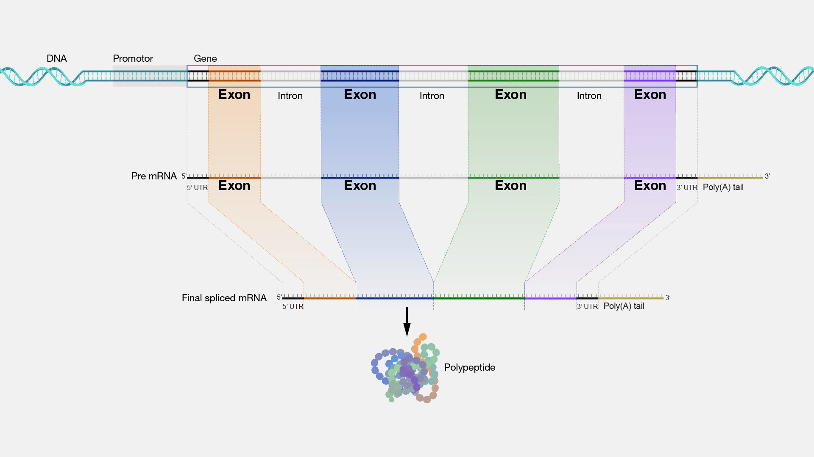

# Sessie 8: Bio-informatica (vervolg)

## Genen en coding sequences

We hebben tot nu toe gewerkt met een _Coding DNA Sequence_, of CDS, van een gen. Je kunt hierbij direct afleiden wat de aminozuur- of eiwitsequentie wordt. Dit is echter niet het _volledige_ gen. Verspreid over het DNA zitten _promotor sites_, waardoor de cel weet dat er een gen begint dat afgelezen moet worden. Vervolgens wordt het volledige gen afgelezen en gekopieerd naar _precursor messenger RNA_ (pre-mRNA). Deze bevat een letterlijke vertaling van het hele gen, maar wordt niet direct gebruikt om eiwitten te maken. Zogeheten _spliceosomen_ koppelen aan stukken in het pre-mRNA en knippen dat eruit. De uitgeknipte stukjes heten _intronen_ en coderen dus niet voor het eiwit. De overgebleven _exonen_ coderen wél voor het eiwit en vormen samen het _mature messenger RNA_ ofwel het bekende mRNA. Vóór het startcodon en ná het stopcodon zitten nog stukjes gen die bedoeld zijn als koppelplaats voor enzymen en eiwitten om te helpen bij het vertalen van het mRNA naar een eiwit, de zogeheten _untranslated regions_, ofwel UTRs. Zie onderstaande afbeelding:

<figure markdown>

<figcaption>Bron: National Human Genome Research Institute (https://www.genome.gov/genetics-glossary/Exon)</figcaption>
</figure>

Wat niet helemaal duidelijk is in het plaatje is dat de de UTRs onderdeel zijn van de exonen. Als je van DNA naar eiwit wilt moet je dus het volgende stappenplan doorlopen:

1. Zorg dat je het DNA kent van een volledig chromosoom.
1. Knip een stuk uit, het gen.
1. Bepaal welke stukjes de exonen zijn en plak die aan elkaar.
1. Knip het middenstuk (zonder de UTRs) er uit, de CDS.
1. Vertaal het CDS naar de eiwitsequentie.

Informatie over genen en eiwitten zijn te vinden in verschillende databases, zoals die van de [National Center for Biotechnology Information](https://www.ncbi.nlm.nih.gov/datasets/gene/). Het hele menselijke genoom is daar ook te downloaden. Voor bovenstaande stappen heb je dus wel wat informatie nodig:

1. Het chromosoomnummer.
1. De locatie van het gen.
1. De locatie van de exonen _binnen_ gen.
1. De locatie van het coderende deel wanneer je de exonen aan elkaar hebt geplakt.

Deze informatie is niet eenvoudig te bepalen uit onderzoek, maar inmiddels is het menselijk genoom grotendeels ontcijferd en zijn deze gegevens te vinden in de databases. We gaan bovenstaand stappenplan doorlopen.

!!! opdracht-basis "Download chromosoom 11"

    Download chromosoom 11 van Canvas, óf doorloop onderstaande stappen om het zelf op te zoeken in de database:

    1. Ga naar [https://www.ncbi.nlm.nih.gov/datasets/genome/](https://www.ncbi.nlm.nih.gov/datasets/genome/) en zoek op `Homo Sapiens`.
    1. Onder **Assembly** zie je `GRCh38.p14` met een groen vinkje, het zogenaamde "referentiegenoom". Klik daar op.
    1. Scroll naar beneden naar **Chromosomes** en klik op de regel `11` op het RefSeq-linkje `NC_000011.10`.
    1. Rechtsbovenin staat in het klein `Send to:`. Klik daar op, kies voor **File** en verander het **Format** in `FASTA`. Klik dan op **Create File**.

    Als je het bestand opent in Teksteditor (TextEditor) of Kladblok (Notepad) dan zie je bovenaan de bekende header, dan een hoop `NNNNN` van `uNknown` omdat de uiteindes van een DNA-streng zeer moeilijk te ontrafelen zijn, en als je verder naar beneden scrollt heel veel A, T, G en C. Chromosoom 11 bestaat uit 135.086.622 nucleobasen!

Voor IFITM1 geldt het volgende:

1. Exon 1 loopt van base 314040 tot en met 314356.
1. Exon 2 loopt van base 314922 tot en met 315272.
1. Binnen het geconstrueerde mRNA loopt de coding sequence van base 132 tot en met 509.
    
Omdat de exon-coördinaten 'absoluut' zijn kun je die direct uit het chromosoom knippen. Je hoeft niet eerst het volledige gen te zoeken.

!!! opdracht-basis "Knip het exon"

    1. Maak een nieuw bestand {{file}}`gene_splicing.py` en kopieer daar je code uit {{file}}`translate_gene.py`.
    1. Maak van de onderste regels commentaar zodat al je functies behouden blijven, maar het script niets doet als je het runt. Haal de regels niet weg, zodat je een geheugensteuntje hebt.
    1. Gebruik je bestaande functies om het FASTA-bestand van chromosoom 11 in te lezen en bewaar dat in de variable `chromosome_11`.
    1. Schrijf een functie `get_dna_region()` die het dna en een begin en eind als parameters accepteert, het stukje exon uitknipt en dat teruggeeft. Tip: in de genetica wordt de allereerste base in een chromosoom als base nummer 1 geteld. Denk na over waarom dit belangrijk is.
    1. Knip exon 1 en exon 2 van het IFITM1 gen uit het chromosoom en plak ze aan elkaar. Dit is het stuk dat overeenkomt met het mRNA. Omdat we hier naar DNA-basen kijken, stop de gegevens in de variabele `mDNA`.
    1. Knip de _coding DNA sequence_ uit het mDNA, maak de aminozuursequentie en vergelijk of dit overeenkomt met je eerder gevonden sequentie.

## De min-streng

De natuur heeft nog een verrassing voor ons in petto. Het FASTA-bestand bevat een lange lijst van de nucleobasen in chromosoom 11. Het probleem is dat dit maar één lijst is, terwijl het DNA _twee_ strengen heeft. Slechts één van die twee strengen staat in het bestand. Deze streng noemt men de _plus-streng_. Dat is een afspraak. Het is gelukkig niet moeilijk om de andere streng, de _min-streng_, te achterhalen want tegenover iedere A ligt een T, tegenover iedere C een G, en omgekeerd. Toch wordt de situatie iets complexer.

De machinerie in de cel zoekt binnen het DNA naar een _promotor site_ en begint vanaf daar het gen af te lezen. Het probleem is dat zo'n promotor site niet altijd op de plus-streng ligt. In ongeveer de helft van de gevallen ligt die op de min-streng. Ook is het zo dat de min-streng in omgekeerde richting wordt afgelezen. Dus als de plus-streng 'van links naar rechts' wordt afgelezen, dan wordt de min-streng 'van rechts van links' afgelezen. Als we een gen hebben dat op de min-streng ligt dan moeten we een exon uitknippen uit de plus-streng, omkeren en complementeren (de 'andere' base bepalen).

!!! opdracht-basis "Reverse complement"

    Werk verder in {{file}}`gene_splicing.py`.

    1. Schrijf een functie `get_reverse_complement()` die een string met DNA-basen accepteert. De functie keert de string om, en geeft een string terug waarin elke A een T is geworden en omgekeerd, en iedere C een G en omgekeerd.
    1. Test je functie met een heel kort stuk verzonnen DNA en controleer het resultaat met de hand.
    1. Schrijf een functie `get_dna_minus_region()` die dna, begin en eind als parameters accepteert en dat je kunt gebruiken om een exon uit de min-streng te knippen. Deze functie knipt, keert om en complementeert. Tip: je had al een functie om te knippen en je hebt net een functie geschreven om om te keren en te complementeren. Gebruik die functies in plaats van dat je het nu weer opnieuw schrijft.

Van een gen weten we het volgende:

1. Het ligt op de min-streng.
1. Exon 1 loopt van base 5226930 tot en met 5227071.
1. Exon 2 loopt van base 5226577 tot en met 5226799.
1. Exon 3 loopt van base 5225464 tot en met 5225726.
1. Binnen het geconstrueerde mRNA loopt de coding sequence van base 51 tot en met 494.

!!! opdracht-basis "Zoek het eiwit"

    Gebruik bovenstaande gegevens om de eiwitsequentie te bepalen waarvoor dit gen codeert. Zoek in de [UniProt database](https://www.uniprot.org/blast) welk eiwit en welk gen dit is.

!!! opdracht-meer "Waar halen wij de informatie vandaan?"

    Hoe komen we aan bovenstaande informatie? Hoe wisten we dat dat gen op de min-streng ligt op chromosoom 11, en waar de exonen liggen? Als je wilt, kun je zelf de dataset opzoeken en analyseren.

    1. Ga naar [de genen databank van het NCBI](https://www.ncbi.nlm.nih.gov/datasets/gene/).
    1. Type in het veld *Gene symbol* de verkorte naam van het gen dat je bij de vorige opdracht hebt gevonden, en in het veld *Taxon* type en kies je `Homo sapiens`.
    1. Kies dan in de lijst het gen met goede symbool (helaas geeft de zoekfunctie veel meer terug).
    1. Klik dan op de blauwe *Download*-knop.
    1. Je kunt dan een aantal verschillende opties aangeven maar zorg dat in ieder geval *Product report* aangevinkt is en download de dataset.
    1. Pak het zip-bestand uit.
    1. Open, in Visual Code, het {{file}}`ncbi_dataset/data/product_report.jsonl`-bestand.
    1. De informatie is nu nog niet echt overzichtelijk. Klink rechtsonder in het VS Code venster op het woord *JSON Lines*.
    1. Kies dan *JSON* (dus zonder toevoeging).
    1. Ga dan in het menu naar **Help > Show All Commands**.
    1. Type in *Format Document* en type enter.
    
    Als het goed is is het document nu over veel regels verspreid en is met inspringing een structuur zichtbaar. Hier staat heel veel (cryptische) informatie, maar als je zoekt op `Reference GRCh38.p14 Primary Assembly` bijvoorbeeld, of `exons` of `cds` dan zie je daar de getallen terug die we jullie hierboven gegeven hebben.

    Als je goed hebt opgelet heb je bij het downloaden gezien dat je niet zelf een heel chromosoom hoeft te downloaden om de coding DNA sequence te vinden. Leerzaam om te oefenen met programmeren en het hele proces te begrijpen, maar wat veel werk als je dat voor veel genen wilt doen.

## DNA-mutaties (voor als je tijd hebt)

Het eiwit dat je hebt ontcijferd is, net als de meeste eiwitten, heel belangrijk voor de mens. Je wilt dus niet dat er iets mis is met dit eiwit. Toch komt het relatief veel voor dat er een fout zit in dit eiwit en dat mensen daar ziek van worden. We gaan daarom in het DNA van 100 patiënten op zoek naar mutaties en zoeken uit of die ziekmakend (kunnen) zijn.

!!! opdracht-basis "Inlezen patiëntdata"
    
    Download het bestand [{{file}}`hbb-patienten-cds.fasta`](data/hbb-patienten-cds.fasta). Open het bestand in VS Code om te zien wat het formaat ongeveer is. Schrijf een script dat deze data inleest en een lijst maakt met de CDS van elke patiënt. Tip: een nieuwe patiënt begint met een nieuwe regel waarna een `>` staat. Analoog aan `#!py text.splitlines()` kun je `#!py text.split()` gebruiken waarbij je een string opgeeft waar hij moet splitsen. Een nieuwe regel geef je aan met `\n`, dus waar moet je op splitsen? Na het splitsen op patiënt, kun je oude code deels hergebruiken om een FASTA-bestand in te lezen.

!!! opdracht-basis "Zoek de mutatie"

    Als je de patiëntendata hebt ingelezen, heb je een lijst met CDS. Vergelijk dit met het CDS dat je eerder hebt gevonden voor dit gen. Elke letter moet hetzelfde zijn. Als dit niet zo is, is er blijkbaar een mutatie. We noteren zo'n mutatie in een standaard formaat als volgt: `c.123A>T` wat betekent dat we kijken naar de *Coding DNA Sequence* (`c.`), dat de mutatie zit op base 123, en dat daar in de referentie een A staat terwijl de patiënt een T heeft. Als dit gelukt is heb je een lijst van mutatie-codes.

!!! opdracht-basis "Leiden Open Variational Database"

    De _Leiden Open Variational Database (LOVD)_ bevat gegevens van _varianten_ bij patiënten. Een variant is een versie van een gen, die anders kan zijn door een mutatie. Artsen en onderzoekers kunnen gevonden mutaties invoeren en koppelen aan patiënten, en melding maken van ziektebeelden. Op die manier kunnen onderzoekers ontdekken of bepaalde mutaties wel of niet ziekmakend zijn, of alleen in bepaalde combinaties. Ook kan vastgelegd worden hoe vaak deze varianten voorkomen.

    Ga naar [de LOVD-pagina voor varianten van ons gen](https://databases.lovd.nl/shared/variants/HBB/unique). Type in het zoekveld *DNA Change (cDNA)* de code in van een mutatie die je hebt gevonden. Als je een resultaat krijgt, kijk dan in de kolom _Clinical Classification_ of deze mutatie ziekmakend is of niet. Mogelijk staat er in de kolom _Haplotype_ informatie over de naam van deze (eventuele) ziekte.
