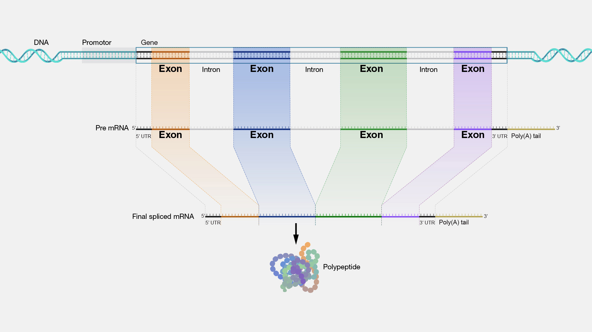

# Bio-informatica

Bio-informatica combineert, zoals de naam al doet vermoeden, _biologie_ met _informatica_. Dat wil zeggen dat computers uitgebreid worden ingezet om onderzoek te doen naar biologische processen en aanverwante onderzoeksrichtingen. [Aan de VU](https://vu.nl/en/about-vu/faculties/faculty-of-science/more-about/bioinformatics-computer-science) wordt vooral onderzoek gedaan naar hoe het genoom het gedrag van een cel bepaalt, op alle niveau's. Computers worden onder andere ingezet om uit grote hoeveelheden data te achterhalen hoe het DNA codeert voor bepaalde eiwitten, hoe deze zich vouwen en leiden tot een bepaalde eiwitstructuur, en hoe de verschillende moleculen in een cel de chemische processen sturen. Op deze manier kan goed bestudeerd worden hoe een DNA-mutatie leidt tot ziekte.

In deze en de volgende sessie zullen we kennismaken met de basisbeginselen. We gaan de genetische code van chromosoom 11 downloaden, knippen daar één bepaald gen uit en bepalen voor welk eiwit het gen codeert. Vervolgens zoeken we op welk eiwit dit is en wat de functie daarvan is in het menselijk lichaam. Daarna gaan we verder met patiëntgegevens: welke patiënten hebben mutaties in dit gen en zijn deze mutaties schadelijk voor de gezondheid? We zullen hiervoor best wat werk moeten verrichten. Ben je uiteindelijk als wetenschapper aan het werk, dan gebruik je uitgebreide bibliotheken waarin al dat werk al is gedaan door andere wetenschappers, maar hier gaan we, als het ware, het wiel opnieuw uitvinden zodat je goed kunt zien welke stappen er nodig zijn. En wie weet, misschien help jij in de toekomst wel om bestaande bibliotheken uit te breiden met jouw analysetools!

!!! info "Aansluiting MNW-programma" 

    In de volgende twee sessies hanteren we een grote hoeveelheid genetische data en gaan we op zoek naar de eiwitten waarvoor bepaalde genen coderen. We zoeken vervolgens informatie daarover op in een publieke database. De module _Basics of Bioinformatics_ van het vak _Basics of Bioinformatics and Systems Biology_ (jaar 2, periode 1) gaat hier dieper op in.

## FASTA-bestanden

Om genetische code uit te wisselen is een heel eenvoudig bestandsformaat bedacht: FASTA. Het ziet er, voor het IFITM1-gen, zó uit:
```
>NM_003641.5:132-509 IFITM1 [organism=Homo sapiens] [GeneID=8519] [region=cds]
ATGCACAAGGAGGAACATGAGGTGGCTGTGCTGGGGCCACCCCCCAGCACCATCCTTCCAAGGTCCACCG
TGATCAACATCCACAGCGAGACCTCCGTGCCCGACCATGTCGTCTGGTCCCTGTTCAACACCCTCTTCTT
GAACTGGTGCTGTCTGGGCTTCATAGCATTCGCCTACTCCGTGAAGTCTAGGGACAGGAAGATGGTTGGC
GACGTGACCGGGGCCCAGGCCTATGCCTCCACCGCCAAGTGCCTGAACATCTGGGCCCTGATTCTGGGCA
TCCTCATGACCATTGGATTCATCCTGTTACTGGTATTCGGCTCTGTGACAGTCTACCATATTATGTTACA
GATAATACAGGAAAAACGGGGTTACTAG
```
Het grootste deel van het bestand is de genetische code: de nucleobasen A, T, G en C in regels die aan elkaar geplakt moeten worden. De allereerste regel begint met een `>` en is een _header_-regel, waarin een beschrijving van het bestand staat. Het eerste stuk `NM_003641.5:132-509` is een zogeheten RefSeq-accessienummer waarmee je het gen kunt opzoeken in wetenschappelijke databases. Zo weet je zeker dat iemand anders naar dezelfde code zit te kijken. Daarna komt de afkorting van het gen `IFITM1` voor _Interferon-induced transmembrane protein 1_, daarna dat dit gen van de mens is, dan een gen identificatienummer, en als laatste het type van deze regio van de genetische code, de _Coding DNA Sequence_ (CDS): het deel van het DNA dat wordt vertaald naar een eiwit. Het eiwit dat gemaakt wordt door dit gen helpt bij het beschermen van celwanden tegen binnendringen door verschillende virussen, waaronder influenza A, Ebola en Sars-CoV-2.

!!! opdracht-basis "{{file}}`IFITM1-cds.fna`"

    Kopieer en plak bovenstaande sequentie in een nieuw {{file}}`IFITM1-cds.fna`-bestand.

!!! info "Tekstmanipulatie"

    Bij het verwerken van FASTA-bestanden hebben we een paar Pythonconstructen nodig:

    1. Inlezen van tekst uit een bestand:
       ```py
       import pathlib

       text = pathlib.Path("my_data.txt").read_text()
       ```
    2. Het splitsen van tekst in losse regels. Dit geeft een lijst van regels en verwijdert de 'enters' uit de tekst:
       ```py
       lines = text.splitlines()
       ```
    3. Het aan elkaar plakken van stukken tekst, met of zonder scheidingstekens:
       ```py
       joined = "123".join(["apple", "banana", "lemon"])
       # apple123banana123lemon

       joined = "".join(["apple", "banana", "lemon"])
       # applebananalemon
       ```
    4. Voor het werken met stukjes uit een string of list (eerste element, laatste zes, etc.) heb je [indexing en slicing](python-constructen.md#indexing-en-slicing) nodig

!!! opdracht-basis "Inlezen van FASTA-bestanden"

    Let op: je hebt de informatie uit het bovenstaande info-blok nodig bij het maken van deze opdracht. We gaan een functie schrijven die een FASTA-bestand inleest en de genetische code teruggeeft. We doen dat in stapjes en bij elk stapje zullen we iets printen om te controleren dat de code werkt. Pas daarna gaan we door met de volgende stap. Dit is een handige programmeerstrategie.

    1. Maak een nieuw {{file}}`translate_gene.py`.
    1. Maak een functie `#!py read_fasta_file()` die een bestandsnaam accepteert als parameter. Print dat je een FASTA-bestand inleest en hoe dat bestand heet. Roep de functie aan met de bestandsnaam `IFITM1-cds.fna`. Test je code; het print-statement zou moeten printen.
    1. Lees alle tekst in het bestand en splits dat in losse regels (zie het info-blok). Print de _header_-regel zodat de gebruiker weet wát er wordt ingelezen. Test je code.
    1. Plak alle andere regels aan elkaar vast zonder scheidingsteken; dit is de sequentie. Print deze.
    1. Print nu _niet_ de hele sequentie, maar alleen de eerste zes nucleobasen, dan `...` en dan de laatste zes nucleobasen.
    1. Geef de sequentie terug en, helemaal aan het eind van je programma, print deze ter controle. Als je zeker weet dat het werkt, mag dit laatste print-statement weer weg.

## Van sequentie naar eiwit

Bij het maken van eiwitten wordt allereerst een gen afgelezen en wordt een streng _messenger RNA_ (mRNA) geproduceerd. Dit mRNA wordt in het ribosoom uiteindelijk omgezet naar een eiwit door voor ieder _codon_ (een groepje van drie nucleobasen) het bijbehorende aminozuur te pakken en alle aminozuren aan elkaar te plakken. Zo codeert AAA voor Lysine en AGC voor Serine. Vervolgens vouwt deze lange streng van aminozuren zich op tot het uiteindelijke eiwit. Voor onze analyse is het niet per se nodig de tussenstap naar mRNA te maken. We kunnen ook gewoon kijken naar de DNA-sequentie en daarvan meteen de aminozuurvolgorde vaststellen.

!!! Codontabellen
    Welk codon codeert voor welk aminozuur vind je bijvoorbeeld [op Wikipedia](https://en.wikipedia.org/wiki/DNA_and_RNA_codon_tables#Standard_DNA_codon_table). Overtypen is veel werk. Daarom mag je onderstaande code kopiëren en plakken in je eigen script. De aminozuren worden weergegeven in _Amino Acid 3-letter codes_:
    ```py
    CODON_TO_AA3 = {
        "TTT": "Phe",
        "TTC": "Phe",
        "TTA": "Leu",
        "TTG": "Leu",
        "TCT": "Ser",
        "TCC": "Ser",
        "TCA": "Ser",
        "TCG": "Ser",
        "TAT": "Tyr",
        "TAC": "Tyr",
        "TAA": "Stop",
        "TAG": "Stop",
        "TGT": "Cys",
        "TGC": "Cys",
        "TGA": "Stop",
        "TGG": "Trp",
        "CTT": "Leu",
        "CTC": "Leu",
        "CTA": "Leu",
        "CTG": "Leu",
        "CCT": "Pro",
        "CCC": "Pro",
        "CCA": "Pro",
        "CCG": "Pro",
        "CAT": "His",
        "CAC": "His",
        "CAA": "Gln",
        "CAG": "Gln",
        "CGT": "Arg",
        "CGC": "Arg",
        "CGA": "Arg",
        "CGG": "Arg",
        "ATT": "Ile",
        "ATC": "Ile",
        "ATA": "Ile",
        "ATG": "Met",
        "ACT": "Thr",
        "ACC": "Thr",
        "ACA": "Thr",
        "ACG": "Thr",
        "AAT": "Asn",
        "AAC": "Asn",
        "AAA": "Lys",
        "AAG": "Lys",
        "AGT": "Ser",
        "AGC": "Ser",
        "AGA": "Arg",
        "AGG": "Arg",
        "GTT": "Val",
        "GTC": "Val",
        "GTA": "Val",
        "GTG": "Val",
        "GCT": "Ala",
        "GCC": "Ala",
        "GCA": "Ala",
        "GCG": "Ala",
        "GAT": "Asp",
        "GAC": "Asp",
        "GAA": "Glu",
        "GAG": "Glu",
        "GGT": "Gly",
        "GGC": "Gly",
        "GGA": "Gly",
        "GGG": "Gly",
    }
    ```

!!! Itereren in sprongen

    Je kent de functie `#!py range()` die je kunt gebruiken in een for-loop om met een index te itereren over een lijst of een string. Bijvoorbeeld met `#!py range(len(dna))`. Range begint bij nul en telt _tot_ de gegeven stopwaarde. Je kunt ook een startwaarde meegeven. Zo telt `#!py range(5, 10)` de waardes 5, 6, 7, 8, 9 af. En als laatste, nuttig voor de volgende opdracht, kun je een step-parameter meegeven: `#!py range(5, 10, 2)` telt de waardes 5, 7, 9 af.

!!! opdracht-basis "Aminozuursequentie"

    We gaan een functie schrijven die, op basis van genetische code, de aminozuursequentie bepaalt. We doen dat weer in stapjes.

    1. Kopieer bovenstaande dictionary in je {{file}}`translate_gene.py`-bestand. Plak de code bovenaan je script, maar _onder_ de import-statement(s).
    1. Definieer, meteen onder de `#!py read_fasta-file()`-functie, een nieuwe functie `#!py get_aminoacid_sequence()` die een `dna_sequence` accepteert als parameter en deze print. Roep, onderin je script, de functie aan met de test-sequentie `TTTGGGTGA`. Test je code. Wat verwacht je nu te zien?
    1. Schrijf een for-loop die een index `i` gebruikt om over de lengte van de DNA-sequentie te stappen. Maak stappen van 3, omdat een codon uit drie basen bestaat, en print de index bij elke stap. Wat verwacht je als uitvoer?
    1. Gebruik de index in je for-loop om ieder codon uit de sequentie te bepalen. Print het codon, en controleer of het klopt.
    1. Zoek bij ieder codon het bijbehorende aminozuur op en voeg die toe aan een lijst van aminozuren. Print aan het eind van je functie de hele lijst van aminozuren.
    1. Geef de lijst terug, minus het laatste (STOP) codon. Bewaar het resultaat van de aanroep naar `#!py get_aminoacid_sequence()` en print deze. Klopt het resultaat?
    1. Haal nu de (overbodig geworden) print-statements weg uit je `#!py get_aminoacid_sequence()`-functie. Te veel output maakt het onoverzichtelijk.
    1. Roep de functie aan met de DNA-sequentie uit het FASTA-bestand in plaats van de test-sequentie en print de volledige lijst met aminozuren.

Als het goed is begint de sequentie met Met, His, Lys en eindigt die op Arg, Gly, Tyr.

!!! opdracht-meer "Compactere weergave"

    In plaats van de hele lijst te printen kun je ook kiezen voor een compactere notatie zoals `Met-His-Lys` of zelfs `MetHisLys`. Kies wat je mooi vindt en pas je script aan.

De vertaalde lijst van aminozuren is niet heel compact. Bij het uitwisselen van gegevens, bijvoorbeeld om eiwitten op te zoeken in een database, wordt vaak gekozen voor éénletterige aminozuurcodes. Je mag onderstaande code kopiëren en plakken:
```py
CODON_TO_AA1 = {
    "TTT": "F",
    "TTC": "F",
    "TTA": "L",
    "TTG": "L",
    "TCT": "S",
    "TCC": "S",
    "TCA": "S",
    "TCG": "S",
    "TAT": "Y",
    "TAC": "Y",
    "TAA": "*",
    "TAG": "*",
    "TGT": "C",
    "TGC": "C",
    "TGA": "*",
    "TGG": "W",
    "CTT": "L",
    "CTC": "L",
    "CTA": "L",
    "CTG": "L",
    "CCT": "P",
    "CCC": "P",
    "CCA": "P",
    "CCG": "P",
    "CAT": "H",
    "CAC": "H",
    "CAA": "Q",
    "CAG": "Q",
    "CGT": "R",
    "CGC": "R",
    "CGA": "R",
    "CGG": "R",
    "ATT": "I",
    "ATC": "I",
    "ATA": "I",
    "ATG": "M",
    "ACT": "T",
    "ACC": "T",
    "ACA": "T",
    "ACG": "T",
    "AAT": "N",
    "AAC": "N",
    "AAA": "K",
    "AAG": "K",
    "AGT": "S",
    "AGC": "S",
    "AGA": "R",
    "AGG": "R",
    "GTT": "V",
    "GTC": "V",
    "GTA": "V",
    "GTG": "V",
    "GCT": "A",
    "GCC": "A",
    "GCA": "A",
    "GCG": "A",
    "GAT": "D",
    "GAC": "D",
    "GAA": "E",
    "GAG": "E",
    "GGT": "G",
    "GGC": "G",
    "GGA": "G",
    "GGG": "G",
}
```

!!! opdracht-basis "Compacte notatie"
    Schrijf een nieuwe functie `#!py get_short_aminoacid_sequence()` die niet een lijst, maar een string teruggeeft met de éénletternotatie van de aminozuursequentie. Gebruik als basis de functie `#!py get_aminoacid_sequence()`. Kopieer de code en pas die daarna aan voor je nieuwe functie.

## Proteomics

Het vakgebied _proteomics_ bestudeert het geheel aan eiwitten in een cel, weefsel of monster: het _proteoom_. Terwijl DNA voor elke cel hetzelfde is verandert het proteoom voortdurend. Allereerst worden in verschillende typen cellen verschillende eiwitten tot expressie gebracht maar een cel reageert ook voortdurend op haar omgeving. Bijvoorbeeld bij een virusinfectie; eiwitten die betrokken zijn bij de afweer kunnen dan veel meer aanwezig zijn. Bij het bepalen van de betrokken eiwitten worden meestal enzymen gebruikt om alle eiwitten in kleine stukken te knippen, zogenaamde _peptidefragmenten_. Met een massaspectrometer wordt van alle stukken de massa bepaalt en met behulp van software wordt aan de hand van doe massa bepaald wat inhoud van de fragmenten zijn en daaruit wat de meest waarschijnlijke eiwitsequenties zijn. Een heel proces, maar zo eindig je met een aminozuursequentie die je kunt opzoeken in [een database](https://www.uniprot.org/blast). Wij hebben een andere weg bewandeld, maar hebben wél een aminozuursequentie.

<div id="opdr:welk-eiwit"></div>
!!! opdracht-basis "Welk eiwit hebben we?"
    Ga naar de [UniProt BLAST database](https://www.uniprot.org/blast) en plak de aminozuursequentie in het veld `Protein or nucleotide sequence(s) in FASTA format.`. De sequentie hoeft, in tegenstelling tot wat het tekstveld suggereert, _niet_ in FASTA-formaat. Gewoon copy-pasten van je eigen output is voldoende. Bekijk het resultaat. Welk eiwit heb je gevonden? Als je op het eiwit klikt in het zoekresultaat krijg je heel veel informatie, onder andere over de functie van het eiwit, en waar het voorkomt binnen een cel.

## Genen en coding sequences

We hebben tot nu toe gewerkt met een _Coding DNA Sequence_, of CDS, van een gen. Je kunt hierbij direct afleiden wat de aminozuur- of eiwitsequentie wordt. Dit is echter niet het _volledige_ gen. Verspreid over het DNA zitten _promotor sites_, waardoor de cel weet dat er een gen begint dat afgelezen moet worden. Vervolgens wordt het volledige gen afgelezen en gekopieerd naar _precursor messenger RNA_ (pre-mRNA). Deze bevat een letterlijke vertaling van het hele gen, maar wordt niet direct gebruikt om eiwitten te maken. Zogeheten _spliceosomen_ koppelen aan stukken in het pre-mRNA en knippen dat eruit. De uitgeknipte stukjes heten _intronen_ en coderen dus niet voor het eiwit. De overgebleven _exonen_ coderen wél voor het eiwit en vormen samen het _mature messenger RNA_ ofwel het bekende mRNA. Vóór het startcodon en ná het stopcodon zitten nog stukjes gen die bedoeld zijn als koppelplaats voor enzymen en eiwitten om te helpen bij het vertalen van het mRNA naar een eiwit, de zogeheten _untranslated regions_, ofwel UTRs. Zie onderstaande afbeelding:

<figure markdown>

<figcaption>Bron: National Human Genome Research Institute (https://www.genome.gov/genetics-glossary/Exon)</figcaption>
</figure>

Wat niet helemaal duidelijk is in het plaatje is dat de de UTRs onderdeel zijn van de exonen. Als je van DNA naar eiwit wilt moet je dus het volgende stappenplan doorlopen:

1. Zorg dat je het DNA kent van een volledig chromosoom.
1. Knip een stuk uit: het gen.
1. Bepaal welke stukjes binnen het gen de exonen zijn en plak die aan elkaar.
1. Knip het middenstuk (zonder de UTRs) er uit: de coding DNA sequence (CDS).
1. Vertaal het CDS naar de eiwitsequentie.

Informatie over genen en eiwitten zijn te vinden in verschillende databases, zoals die van de [National Center for Biotechnology Information](https://www.ncbi.nlm.nih.gov/datasets/gene/). Het hele menselijke genoom is daar ook te downloaden. Voor bovenstaande stappen heb je dus wel wat informatie nodig:

1. Het chromosoomnummer.
1. De locatie van het gen.
1. De locatie van de exonen _binnen_ gen.
1. De locatie van het coderende deel wanneer je de exonen aan elkaar hebt geplakt.

Deze informatie is niet eenvoudig te bepalen uit onderzoek, maar inmiddels is het menselijk genoom grotendeels ontcijferd en zijn deze gegevens te vinden in de databases. We gaan bovenstaand stappenplan doorlopen.

!!! opdracht-basis "Download chromosoom 11"

    Download chromosoom 11 van Canvas, óf doorloop onderstaande stappen om het zelf op te zoeken in de database:

    1. Ga naar [https://www.ncbi.nlm.nih.gov/datasets/genome/](https://www.ncbi.nlm.nih.gov/datasets/genome/) en zoek op `Homo Sapiens`.
    1. Onder **Assembly** zie je `GRCh38.p14` met een groen vinkje, het zogenaamde "referentiegenoom". Klik daar op.
    1. Scroll naar beneden naar **Chromosomes** en klik op de regel `11` op het RefSeq-linkje `NC_000011.10`.
    1. Rechtsbovenin staat in het klein `Send to:`. Klik daar op, kies voor **File** en verander het **Format** in `FASTA`. Klik dan op **Create File**. Het kan makkelijk zijn om het {{file}}`sequence.fasta` bestand te hernoemen naar {{file}}`chromosome_11.fasta`.

    Als je het bestand opent in Teksteditor (TextEditor) of Kladblok (Notepad) dan zie je bovenaan de bekende header, dan een hoop `NNNNN` (de N van uNknown) omdat de uiteindes van een DNA-streng zeer moeilijk te ontrafelen zijn, en als je verder naar beneden scrollt heel veel A, T, G en C. Chromosoom 11 bestaat uit 135.086.622 nucleobasen!

Voor IFITM1 geldt het volgende:

1. Exon 1 loopt van base 314040 tot en met 314356.
1. Exon 2 loopt van base 314922 tot en met 315272.
1. Binnen het geconstrueerde mRNA loopt de coding sequence van base 132 tot en met 509.
    
Omdat de exon-coördinaten gegeven zijn ten opzichte van de start van het chromosoom kun je die direct uit het chromosoom knippen. Je hoeft niet eerst het volledige gen te zoeken.

!!! opdracht-basis "Knip het exon"

    1. Maak een nieuw bestand {{file}}`gene_splicing.py` en kopieer daar je code uit {{file}}`translate_gene.py`.
    1. Maak van de onderste regels commentaar (gebruik de sneltoetscombinatie ++cmd+slash++ (macOS) / ++ctrl+slash++ (Windows)) zodat al je functies behouden blijven, maar het script niets doet wanneer je het runt. Haal de regels niet weg, zodat je een geheugensteuntje hebt.
    1. Kijk naar je geheugensteuntje en gebruik nieuwe functie-aanroepen om het FASTA-bestand van chromosoom 11 in te lezen en bewaar dat in de variable `chromosome_11`.
    1. Schrijf een functie `get_dna_region()` die het `dna` en een `begin` en `end` als parameters accepteert. De functie knipt een stukje uit het dna, van `begin` _tot en met_ `end` en geeft dat terug. Let op: in de genetica telt de _eerste base_ als base 1. Python telt anders. Je kunt de functie testen op een stukje test-dna. Knip base 3 t/m base 5 uit het onzin-dna "abcdefg". Welk antwoord verwacht je dan?
    1. Gebruik je functie om exon 1 en exon 2 van het IFITM1 gen uit het chromosoom te knippen en plak ze aan elkaar. Dit is het stuk dat correspondeert met het mRNA. Omdat we hier nog naar DNA-basen kijken, stop je het aan elkaar geplakte stuk in de variabele `mDNA`.
    1. Knip de _coding DNA sequence_ uit het mDNA en print die. Controleer dat het eerste codon "ATG" is, het startcodon, en controleer dat het laatste codon een stopcodon is.
    1. Maak de korte aminozuursequentie. Je hoeft nu niet meer de hele CDS te printen, maar print wel de kort aminozuursequentie en vergelijk of dit overeenkomt met de eerder gevonden sequentie van de opdracht [Welk eiwit hebben we?](#opdr:welk-eiwit).

## De min-streng

De natuur heeft nog een verrassing voor ons in petto. Het FASTA-bestand bevat een lange lijst van de nucleobasen in chromosoom 11. Het probleem is dat dit maar één lijst is, terwijl het DNA _twee_ strengen heeft. Slechts één van die twee strengen staat in het bestand. Deze streng noemt men de _plus-streng_. Dat is een afspraak. Het is gelukkig niet moeilijk om de andere streng, de _min-streng_, te achterhalen want tegenover iedere A ligt een T, tegenover iedere C een G, en omgekeerd. Toch wordt de situatie iets complexer.

De machinerie in de cel zoekt binnen het DNA naar een _promotor site_ en begint vanaf daar het gen af te lezen. Het probleem is dat zo'n promotor site niet altijd op de plus-streng ligt. In ongeveer de helft van de gevallen ligt die op de min-streng. Ook is het zo dat de min-streng in omgekeerde richting wordt afgelezen. Dus als de plus-streng 'van links naar rechts' wordt afgelezen, dan wordt de min-streng 'van rechts naar links' afgelezen. Als we een gen hebben dat op de min-streng ligt dan moeten we, in onze data, een exon uitknippen uit de plus-streng, omkeren en complementeren (de 'andere' base bepalen).

!!! opdracht-basis "Reverse complement"

    Werk verder in {{file}}`gene_splicing.py`. We gaan twee functies maken en delen het werk op in kleine stappen die we steeds zullen testen.

    1. Schrijf een functie `get_reverse_complement()` die `dna` als parameter accepteert. Roep de functie aan met een stukje test-DNA: `AATCG`. Laat de functie `dna` printen.
    1. In de functie keer je de string om, bewaar dat in `reversed_dna` en print het resultaat. Klopt het met je verwachting?
    1. Als laatste moet de functie een string teruggeven waarin elke A een T is geworden en omgekeerd, en iedere C een G en omgekeerd. Tip: doe dit letter voor letter en gebruik een dictionary. Als je in die dictionary de `A` opzoekt, krijg je `T` als resultaat, enz. Blijf het resultaat printen terwijl je bezig bent en test ieder stapje.
    1. Schrijf een functie `get_dna_minus_region()` die `dna`, `begin` en `end` als parameters accepteert en dat je kunt gebruiken om een exon uit de min-streng te knippen. Deze functie knipt, keert om en complementeert. Tip: je had al een functie om te knippen en je hebt net een functie geschreven voor een reverse complement. Gebruik die functies in plaats van dat je het nu weer opnieuw schrijft. Test de functie met het onzin-DNA "AATCG" en knip base 2 t/m 4 eruit. Wat verwacht je? Klopt je uitkomst?

Van een gen weten we het volgende:

1. Het ligt op de min-streng.
1. Exon 1 loopt van base 5226930 tot en met 5227071.
1. Exon 2 loopt van base 5226577 tot en met 5226799.
1. Exon 3 loopt van base 5225464 tot en met 5225726.
1. Binnen het geconstrueerde mRNA loopt de coding sequence van base 51 tot en met 494.

!!! opdracht-basis "Zoek het eiwit"

    Gebruik bovenstaande gegevens om de eiwitsequentie te bepalen waarvoor dit gen codeert. Controleer dat het eerste codon weer een startcodon (ATG) is en het laatste codon een stopcodon, voordat je de aminozuursequentie vaststelt. Zoek in de [UniProt BLAST database](https://www.uniprot.org/blast) welk eiwit en welk gen dit is.

!!! opdracht-meer "Waar halen wij de informatie vandaan?"

    Hoe komen we aan bovenstaande informatie? Hoe wisten we dat dat gen op de min-streng ligt op chromosoom 11, en waar de exonen liggen? Als je wilt, kun je zelf de dataset opzoeken en analyseren.

    1. Ga naar [de genen databank van het NCBI](https://www.ncbi.nlm.nih.gov/datasets/gene/).
    1. Type in het veld *Gene symbol* de verkorte naam van het gen dat je bij de vorige opdracht hebt gevonden, en in het veld *Taxon* type en kies je `Homo sapiens`.
    1. Kies dan in de lijst het gen met goede symbool (helaas geeft de zoekfunctie veel meer terug).
    1. Klik dan op de blauwe *Download*-knop.
    1. Je kunt dan een aantal verschillende opties aangeven maar zorg dat in ieder geval *Product report* aangevinkt is en download de dataset.
    1. Pak het zip-bestand uit.
    1. Open, in Visual Code, het {{file}}`ncbi_dataset/data/product_report.jsonl`-bestand.
    1. De informatie is nu nog niet echt overzichtelijk. Klink rechtsonder in het VS Code venster op het woord *JSON Lines*.
    1. Kies dan *JSON* (dus zonder toevoeging).
    1. Ga dan in het menu naar **Help > Show All Commands**.
    1. Type in *Format Document* en type enter.
    
    Als het goed is is het document nu over veel regels verspreid en is met inspringing een structuur zichtbaar. Hier staat heel veel (cryptische) informatie, maar als je zoekt op `Reference GRCh38.p14 Primary Assembly` bijvoorbeeld, of `exons` of `cds` dan zie je daar de getallen terug die we jullie hierboven gegeven hebben.

    Als je goed hebt opgelet heb je bij het downloaden gezien dat je niet zelf een heel chromosoom hoeft te downloaden om de coding DNA sequence te vinden. Leerzaam om te oefenen met programmeren en het hele proces te begrijpen, maar wat veel werk als je dat voor veel genen wilt doen.

## DNA-mutaties

Het eiwit dat je hebt ontcijferd is, net als de meeste eiwitten, heel belangrijk voor de mens. Je wilt dus niet dat er iets mis is met dit eiwit. Toch komt het relatief veel voor dat er een fout zit in dit eiwit en dat mensen daar ziek van worden. We gaan daarom in het DNA van 100 patiënten op zoek naar mutaties en zoeken uit of die ziekmakend (kunnen) zijn.

!!! opdracht-basis "Inlezen patiëntdata"
    
    Download het bestand [{{file}}`hbb-patienten-cds.fasta`](data/hbb-patienten-cds.fasta). Open het bestand in VS Code om te zien wat het formaat ongeveer is. We gaan een script schrijven dat deze data inleest en een lijst maakt met de CDS van elke patiënt. Een nieuwe patiënt begint met een nieuwe regel waarna een `>` staat. Analoog aan `#!py text.splitlines()` kun je `#!py text.split()` gebruiken waarbij je een string opgeeft waar hij moet splitsen.

    1. Start een nieuw script {{file}}`find_mutations.py`. Definieer een nieuwe functie `#!py read_patient_data()` die `filename` als parameter accepteert. Roep je functie aan met {{file}}`hbb-patienten-cds.fasta` als argument.
    1. In je functie lees je de tekst uit het bestand en splitst het vervolgens op `>`. Print het eerste, tweede en derde element uit het resultaat. Wat valt je op aan het eerste element?
    1. Maak een lege lijst `sequences`. Schrijf een for-loop waarmee je over alle patiëntgegevens loopt. Je hebt nu voor iedere patiënt feitelijk een stukje FASTA-bestand. Print de header (zodat je weet welke patiënt je inleest), bepaal de sequentie, en print weer de eerste zes en de laatste zes nucleobasen. Je hebt dit eerder gedaan en kunt wat oude code kopiëren en aanpassen.
    1. De sequentie die je per patiënt bepaalt kun je toevoegen aan de `sequences` variabelen, en geef die terug uit de functie.
    1. Na het aanroepen van de functie, print de sequentie van de eerste patiënt. Lijkt dat te kloppen met wat er in het FASTA-bestand staat? Hoeveel patiënten heb je uitgelezen? Klopt dat?

!!! opdracht-basis "Zoek de mutatie"

    Als je de patiëntendata hebt ingelezen, heb je een lijst met CDSs. We gaan dit vergelijken met het CDS dat je eerder hebt gevonden voor dit gen. Elke letter moet hetzelfde zijn. Als dit niet zo is, is er blijkbaar een mutatie. We noteren zo'n mutatie in een standaard formaat als volgt: `c.123A>T` wat betekent dat we kijken naar de *Coding DNA Sequence* (`c.`), dat de mutatie zit op base 123, en dat daar in de referentie een A staat terwijl de patiënt een T heeft. Als dit gelukt is heb je een lijst van mutatie-codes. Voer de volgende opdrachten uit:
    
    1. Gebruik je oude programma {{file}}`gene_splicing.py` om de CDS uit te printen dat je hebt gevonden voor het gen dat op de min-streng ligt (dit was de laatste opdracht). Kopieer de tekst en definieer in {{file}}`find_mutations.py` een variabele `reference_cds` met als inhoud de gevonden CDS.
    1. Schrijf een functie `#!py find_mutations()` die `patient_data` en `reference_cds` als parameters accepteert. Om te testen, roep je je functie als volgt aan:
    ```py
    find_mutations(["AATCG", "ATTCC"], "AATCG")
    ```
    Hoe zit deze aanroep in elkaar?
    1. Loop over de patiëntgegevens. Print de CDS van iedere patiënt om te testen.
    1. Binnen die loop, vergelijk de CDS van de patiënt base voor base met de referentie-CDS. Tel de letters: als er één verschilt, willen we weten wat het nummer is van de base. Als je een verschil vindt: print het verschil in bovenstaand format `c.123A>T`. Wat verwacht je te krijgen uit je test-aanroep?
    1. Als je geen f-strings gebruikt (paarse opdracht) krijg je nu spaties tussen de verschillende onderdelen in je print-statement. Je kunt `sep=""` toevoegen aan je print-statement als volgt:
    ```py
    print("Text1", var1, var2, "text2", sep="")
    ```
    om de spaties weg te halen. "sep" staat voor _separator_ ofwel scheidingsteken.
    1. Als je tevreden bent over je resultaat, roep dan de functie `#!py find_mutations()` aan met de echte referentie CDS en de echte patiëntgegevens.

!!! opdracht-basis "Leiden Open Variational Database"

    De _Leiden Open Variational Database (LOVD)_ bevat gegevens van _varianten_ bij patiënten. Een variant is een versie van een gen, die anders kan zijn door een mutatie. Artsen en onderzoekers kunnen gevonden mutaties invoeren en koppelen aan patiënten, en melding maken van ziektebeelden. Op die manier kunnen onderzoekers ontdekken of bepaalde mutaties wel of niet ziekmakend zijn, of alleen in bepaalde combinaties. Ook kan vastgelegd worden hoe vaak deze varianten voorkomen.

    Ga naar [de LOVD-pagina voor varianten van ons gen](https://databases.lovd.nl/shared/variants/HBB/unique). Type in het zoekveld *DNA Change (cDNA)* de code in van een mutatie die je hebt gevonden. Als je een resultaat krijgt, kijk dan in de kolom _Clinical Classification_ of deze mutatie ziekmakend is of niet. Mogelijk moet je de gebruikte termen opzoeken, zoals `VUS`. Voor relatief veel voorkomende mutaties staat er in de kolom _Haplotype_ informatie over de naam van deze (eventuele) ziekte.
