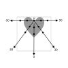
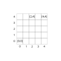
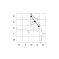
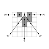
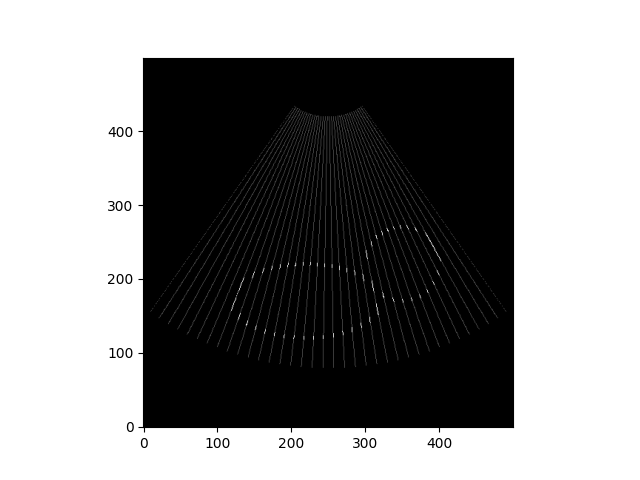

# Sessie 9: Echografie

## Uitleg over de werking van Echografie
Bij echografie wordt gebruik gemaakt van geluidsgolven met een hoge frequentie (ultrasound). De geluidsgolven worden door een probe(P) uitgezonden. Wanneer een geluidsgolf bij een overgang van het ene weefsel en het andere weefsel aankomt een deel van de geluidsgolf gereflecteerd worden (echo) en een deel doorgelaten worden (transmissie). De doorgelaten geluidsgolven kunnen verderop in het lichaam alsnog reflecteren en een echo signaal veroorzaken. De probe kan deze signalen ontvangen en registreren. Tijdens het maken van een beeld wisselt de probe tussen uitzenden en ontvangen. De tijd tussen het uitzenden van de geluidsgolf en het ontvangen van de echo geeft in combinatie met de geluidssnelheid informatie over de afstand van de probe tot aan het weefsel. Door in een vlak onder verschillende hoeken echo signalen op te vangen kan een 2D beeld van de locatie van weefsel gevormd worden.

Bij echografie wordt gebruik gemaakt van geluidsgolven met een hoge frequentie (ultrasound). De geluidsgolven worden door een probe (P) uitgezonden. De geluidsgolven weerkaatsen tegen weefsel (echo) en komen bij de probe terug, die de echosignalen ontvangt en registreerd. Door de geluidsgolven onder verschillende hoeken uit te zenden kan een 2D beeld van het weefsel gevormd worden. 

## Hoe komt de data tot stand
Om een idee te krijgen van het proces van echografie ga je zelf data verzamelen. We maken daarbij gebruik van een versimpelde werking van echografie. In onderstaande figuur zie je grijs weefsel in de vorm van een hart.


De probe (P) wordt in het midden bovenaan geplaats en zend in een het x,y-vlak geluidsgolven uit. Om het eenvoudig te houden gaan we in ieder van de 5 richtingen (-90,-30,0,30,90) op 3 afstanden kijken naar het echosignaal (zwarte rondjes).



Als voorbeeld kijken we naar de richting -90. Bij het eerste zwarte rondje is het weefsel wit en is het signaal laag (0), bij het tweede zwarte rondje is het weefsel grijs en is het signaal hoog (1), bij het derde zwarte rondje is het signaal weer laag (0). De data die de probe naar de computer stuurt is de hoek en de signalen op de drie posities: -90,0,1,0. Maak het bestand voor de data af voor de overige hoeken.

### antwoord
-90,0,1,0
-30,0,1,0
0,0,1,1
30,0,1,0
90,0,1,0

## Hoe weet je waar het signaal vandaan kwam
In het echt heb je geen idee van hoe het weefsel eruit ziet en krijg je alleen de data terug die je bij de vorige opdracht hebt opgeschreven. We gaan het plaatje pixel voor pixel opbouwen. Omdat we met een hoek van 90 graden beide kanten op hebben gemeten hebben we over de x-as 5 meetpunten (het meetpunt voor 0 overlapt), dus laten we een een plaatje van 5 bij 5 pixels maken. We zetten de oorsprong linksonder en geven de locatie van de pixel aan met x en y waardes. Pixel (0,0) ligt linksonder en pixel (4,4) ligt rechtsboven. De probe zat in het midden bovenaan, dus op pixel (2,4).

.

We moeten er nu achter gaan komen wat de locatie was van bijvoorbeeld het derde datapunt bij een hoek van 30 graden. Als we de x en y waarde daarvan weten, kunnen we de waarde van de data aan de pixel toekennen en op die manier een plaatje construeren.
Zoals eerder gezegd hangt een datapunt samen met een afstand. Om het eenvoudig te houden stellen we dat het eerste datapunt op afstand r=0 zit, het tweede op afstand r=1 en het derde op afstand r=2. De hoek van de geluidsgolf met de 0 graden lijn noemen we phi. Gebruik onderstaande afbeelding en al je geometrische toverkracht om een algemene uitdrukking voor x en y te vinden.




## Hoe komt het plaatje tot stand
Je hebt nu een uitdrukking voor x en y in termen van een hoek phi en een afstand r. Als je terugkijkt naar de vorige afbeelding dan zie je dat een datapunt ergens in een pixel terecht kan komen. Om de waarde van het datapunt aan de pixel toe te kennen moeten we niet alleen de x en y waarde van het datapunt weten maar x en y waarde van de pixel. Geef voor de 3 datapunten in de afbeelding de x en y waarde van de pixel.

### antwoord
r=0: [2,4]
r=1: [3,3]
r=2: [3,2]


Teken een vlak van 5 bij 5 pixels, geef alle pixels in eerste instantie een waarde 0. Je kunt de waarde aangeven met een kleur (bijvoorbeeld 0=wit, 1=grijs). 
Gebruik de data uit een vorig opdrachten en de uitdrukkingen voor x en y om de data te vertalen naar x en y waardes van de pixel. Tip: reken alleen de pixel locaties uit voor de datapunten met waarde 1.

### antwoord



## Meer data meer beter
Je hebt bij de vorige opdracht vast gezien dat het plaatje meer leek op een kip dan op een hartje[^afronden]. Als je onder meer hoeken en met meer datapunten zou werken zal je zien dat de resolutie van het plaatje steeds beter wordt. Maar dan is het niet meer met de hand uit te rekenen, dus op naar de programmeeropdracht!


[^afronden]: Mocht je het rekenwerk hebben uitbesteed aan Python dan kan het zijn dat jij een symmetrisch plaatje hebt gekregen terwijl andere mensen die het met de hand uitrekenen een asymmetrisch plaatje kregen (de 'kip'). De reden dat de uitkomsten verschillen heeft te maken met afronden. Als je met de hand hebt uitgerekend rond je waarschijnlijk 2.5 af naar boven, zoals je ook op school hebt geleerd. Maar Python doet dat anders, die rond het af naar het dichtsbijzijnde even getal. Dus 1.5 wordt 2 en 2.5 wordt ook 2. Dit voorkomt een bias naar hogere getallen wat je krijgt als je altijd naar boven afrond. 

# Ultrasound programmeeropdracht
Het reconstrueren van het plaatje vanuit de echographiedata heb je zojuist met de hand gedaan. In de volgende opdrachten ga je de stappen omzetten naar Python code. 

Er zijn twee csv-bestanden beschikbaar: [phantom](data/ultrasound_phantom.csv) en [baby](data/ultrasound_baby.csv). De eerste is een test-bestand. De data bestaat uit 3 niveaus, 0.0 (geen signaal), 0.3 (een zwak signaal) en 1.0 (sterk signaal). Net als bij de vorige opdracht bestaat de eerste kolom uit hoeken en de andere kolommen uit metingen. Als je deze data omzet in een plaatje verwacht je een ovaal met een cirkel:

 
 
 Als het test-bestand gelukt is kun je het baby-plaatje gaan reconstrueren. Deze data bestaat uit meer hoeken en meer data-niveaus. Idealiter schrijf je de code op zo'n manier dat je alleen het pad naar het bestand hoef aan te passen en het verder niet uitmaakt hoeveel rijen of data niveau's er zijn.

Reconstrueer het plaatje op een vlak van 500 bij 500 pixels. De probe zit weer in het midden bovenaan (pixel (250,499)). Om een vlak van x bij y pixels in Python te construeren kun je een lege lijst vullen met y keer een lijst met x kolomen. Hieronder zie je een voorbeeld code van een vlak van 5 bij 5 pixels. In eerste instantie hebben alle pixels dezelfde waarde (0.0) met behulp van pixelcoördinaten kun je de waarde aanpassen. Let op: geef eerst aan in welke rij de pixel zit (y-waarde) en daarna in welke kolom (x-waarde).

In de oefenopdracht zet de probe in pixel (2,4). Pas de code aan zodat pixel (2,4) de waarde 1.0 krijgt. 
### antwoord
```
image[4][2] = 1.0
```


Om de pixels te tonen gebruiken we 'imshow' van matplotlib.pyplot, 'cmap ="gray"' zorgt ervoor dat de waardes van de pixels worden omgezet in grijswaardes, 'origin="lower" zorgt ervoor dat pixel (0,0) in de linkeronderhoek terecht komt. Wat er gebeurt als je 'cmap ="gray"' of 'origin="lower" weghaalt?
### antwoord
'cmap ="gray"' weghalen maakt de kleuren paars en geel.
'origin="lower" weghalen dan draait de y-as om en zit (0,0) linksboven.

```
import matplotlib.pyplot as plt

SIZE_X = 5
SIZE_Y = 5

image = []
for y in range(SIZE_Y):
    # Add one row with SIZE pixels. Repeating this builds a 2D image.
    image.append([0.0] * SIZE_X)

image[y_pixel][x_pixel] = 1.0

plt.imshow(image, cmap="gray", origin="lower")
plt.show()
```

In de oefenopdracht ben je waarschijlijk tot de conclusie gekomen dat je sinussen en cossinussen nodig hebt om de locaties te bepalen en dat je moet afronden om pixel waardes te krijgen. In de code hieronder staat uitgelegd hoe je die kunt gebruiken. 
```
from math import cos, radians, sin
# zet de hoek om in radialen!
phi_rad = radians(30)
sin_30 = sin(phi_rad)
cos_30 = cos(phi_rad)
# afronden doe je met round()
afgerond_sin_30 = round(sin_30)
afgerond_cos_30 = round(cos_30)
```

Voordat je de code verder gaat uitwerken wil je eerst het plan helder hebben. Kijk terug naar de voorbeeldopdracht, welke stappen heb je daar gemaakt. Maak de stappen zo klein mogelijk en verwerk ze in de opdrachten hieronder. 

## De start toestand
Wat is de start toestand van het probleem? Beschrijf vanuit waar je het probleem moet gaan oplossen.

## Het doel
Wanneer het doel is bereikt is het probleem opgelost. Omschrijf wat je wilt bereiken.

## De spelregels
De mogelijkheden om van de start naar het doel te raken worden beperkt door spelregels. Aan welke spelregels moet jouw oplossing voldoen?

## Commentaar
Verwerk de start toestend, de spelregels en het doel in stukjes commentaar. 

## Code
Zet onder de regels commentaar de code om het programma te laten werken. Begin met stukjes code die je meteen weet op te schrijven. Test je code (zie "voorbeelden-test-je-code.py") steeds voordat je verder gaat. Maak een schets op papier als je niet weet hoe je verder moet. Leg je probleem uit aan je buurmens als je vastloopt. Kijk in vorige (voorbeeld) opdrachten voor inspiratie om de code werkend te krijgen.
