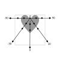
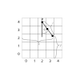
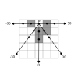
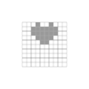
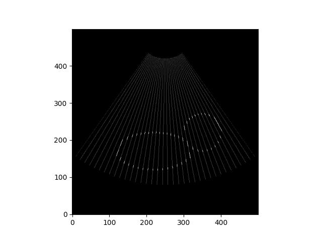

# Echografie

Met echografie kunnen we in het lichaam kijken zonder het open te maken. We kunnen bijvoorbeeld een ongeboren kind in beeld brengen of onderzoeken hoe het hart eruitziet en functioneert. Daarvoor gebruiken we geluidsgolven: een echoapparaat zendt geluid uit en vangt de terugkerende echo's op. Deze echo's leveren nog geen kant-en-klaar beeld op. Software verwerkt de ontvangen geluidssignalen tot een beeld van de weefsels. In dit hoofdstuk onderzoeken we dit proces. We zoeken eerst uit hoe we geluidssignalen kunnen omzetten in een beeld. Daarna vertalen we die stappen naar code en programmeren we het proces zelf.

## Hoe ontstaat een echobeeld?

Om te begrijpen hoe we van geluidssignalen een beeld kunnen maken, bekijken we eerst hoe die signalen ontstaan. Bij echografie gebruiken we geluidsgolven met een hoge frequentie. Dit noemen we ultrageluid (Engels: _ultrasound_). Een probe zendt deze golven het lichaam in. Op de grens tussen twee weefsels wordt een deel van het geluid gereflecteerd. Daardoor ontstaat een echo. De rest wordt doorgelaten en kan dieper in het lichaam opnieuw worden gereflecteerd. 

De probe wisselt tussen het uitzenden van geluid en het ontvangen van echo's. Uit de tijd tussen het uitzenden en het ontvangen kunnen we, met behulp van de geluidssnelheid, de afstand berekenen tot de plek waar de echo ontstond. De sterkte van de echo bepaalt hoe helder die plek in het beeld wordt weergegeven. Een probe zendt geluidsgolven in verschillende richtingen binnen een vlak uit en ontvangt de bijbehorende echo's. De software combineert deze informatie tot een tweedimensionaal beeld van de weefsels.

## Van meetpunt naar gegevensbestand

Om straks de bestanden met gegevens goed te kunnen interpreteren, verzamelen we eerst zelf data op papier. Zo ontdekken we hoe zo'n bestand is opgebouwd en wat de waarden erin betekenen. We gebruiken hiervoor een sterk vereenvoudigd model van echografie. 

In onderstaand figuur zie je een grijs gebied in de vorm van een hart: 


In het volgende figuur zijn de probe $P$ en de vijf richtingen waarin deze meet toegevoegd. De probe staat bovenaan in het midden en zendt geluidsgolven uit in het $x$,$y$-vlak. De vijf meetrichtingen komen overeen met hoeken van -90$\degree$, -30$\degree$, 0$\degree$, 30$\degree$ en 90$\degree$, waarbij 0$\degree$ recht naar beneden wijst. In elke richting meten we op drie afstanden vanaf de probe. Elk meetpunt is aangegeven met een zwarte stip. De eerste meting doen we bij de probe zelf, op afstand 0. 



In ons vereenvoudigde model geeft een meetpunt in het witte gebied een laag signaal, dat we noteren als 0. Een meetpunt in het grijze gebied geeft een hoog signaal, dat we noteren als 1. Het signaal hangt dus alleen af van de kleur op het meetpunt. We kijken in dit model niet naar reflecties op weefselgrenzen, zoals bij echografie wel gebeurt.

<div id="opdr:handmatige-scan"></div>
!!! opdracht-basis "Handmatige scan"

    We gaan nu de meetgegevens op papier noteren zoals ze straks in een bestand staan. Voor elke meetrichting schrijven we de hoek en de signalen op de drie meetpunten op, van dichtbij naar ver weg. We zetten deze waarden op één regel, gescheiden door komma's. Voor de richting -90$\degree$ zijn de signalen achtereenvolgens laag, hoog en laag. Dat geeft: `-90,0,1,0`.

    1. Neem de voorbeeldregel voor -90$\degree$ over op papier en vul de gegevens voor de overige vier richtingen aan. Gebruik voor elke richting een nieuwe regel en dezelfde opbouw als in het voorbeeld. Aan het einde heb je vijf regels: één voor elke richting.

<!--
### antwoord
```
-90,0,1,0
-30,0,1,0
0,0,1,1
30,0,1,0
90,0,1,0
```
-->

## Van meetgegevens naar beeld

Bij echografie wordt een beeld opgebouwd op basis van meetgegevens. We doen dit eerst op papier, zodat we begrijpen hoe die gegevens worden omgezet in een beeld. Hiervoor gebruiken we de uitkomst van de [_opdracht Handmatige scan_](#opdr:handmatige-scan).

We bouwen het beeld pixel voor pixel op. Hiervoor gebruiken we een raster van 5 bij 5 pixels, zoals in onderstaand figuur. We zetten de oorsprong linksonder en geven de positie van elke pixel aan met twee coördinaten: eerst de $x$-coördinaat en daarna de $y$-coördinaat. Beide lopen van 0 tot en met 4. Pixel [0,0] ligt dus linksonder en pixel [4,4] rechtsboven. De probe $P$ staat bovenaan in het midden, op pixel [2,4].

![afbeelding van 5 bij 5 pixels met [0,0], [2,4] en [4,4] aangegeven in de betreffende pixel](figures/hart_ultra-sound_4a.svg).

Om de meetgegevens om te zetten in een beeld, moeten we bepalen waar elk meetpunt ligt. Waar ligt bijvoorbeeld het derde meetpunt in de richting 30$\degree$? Als we de $x$- en $y$-coördinaten kennen, kunnen we de signaalwaarde aan een pixel toekennen.

!!! opdracht-basis "Van meetpunt naar pixel"

    Elk meetpunt ligt op een bepaalde afstand van de probe $P$. Het eerste meetpunt ligt bij de probe zelf, op afstand $r=0$. Het tweede meetpunt ligt op afstand $r=1$ en het derde meetpunt op $r=2$. We gebruiken hier de pixels van het raster als maat: een afstand van 1 is gelijk aan de breedte van één pixel. De hoek ten opzichte van de richting naar beneden, 0$\degree$, noemen we $\phi$.
    
    

    1. In bovenstaand figuur zijn drie meetpunten aangegeven voor de richting van 30$\degree$. In welke pixels liggen deze meetpunten? Noteer voor elk meetpunt de coördinaten van de bijbehorende pixel en de afstand $r$ tot de probe.
    2. Gebruik het figuur en je kennis van goniometrie om vergelijkingen voor $x$ en $y$ op te stellen in termen van $r$ en $\phi$. Houd rekening met de positie van de probe in pixel [2,4].
    3. Bereken met je vergelijkingen de coördinaten van de drie meetpunten voor de richting 30$\degree$. Rond de coördinaten af op gehele getallen en vergelijk ze met de pixelcoördinaten die je eerder hebt afgelezen. Komen ze overeen?

<!--
### antwoord
r=0: [2,4]
r=1: [3,3]
r=2: [3,2]
-->

Met de gevonden vergelijkingen kunnen we bepalen waar een meetpunt ligt. Om een beeld te reconstrueren, geven we de bijbehorende pixel de signaalwaarde van dat meetpunt. In dit eenvoudige geval is dat een 0 of een 1. Zo bouwen we het beeld stap voor stap op.

!!! opdracht-basis "Reconstructie van het beeld"

    1. Teken een raster van 5 bij 5 pixels. Geef de pixel linksonder de coördinaten [0,0]. Nummer de pixels op beide assen van 0 tot en met 4. Laat alle pixels wit, ze hebben dan allemaal de waarde 0.
    2. Gebruik de uitkomst van de [_opdracht Handmatige scan_](#opdr:handmatige-scan). Bereken voor elk meetpunt de $x$- en $y$-coördinaten met de gevonden vergelijkingen. Rond de coördinaten af op gehele getallen en geef de bijbehorende pixel de signaalwaarde van het meetpunt. Laat pixels met de waarde 0 wit en kleur pixels met de waarde 1 grijs.
    3. Vergelijk het gereconstrueerde beeld met het oorspronkelijke beeld. Komen ze overeen?

<!--
### antwoord

-->

Het gereconstrueerde beeld komt niet precies overeen met het oorspronkelijke beeld. Sommige meetpunten liggen precies op de grens tussen twee pixels. Door hun coördinaten af te ronden, kiezen we aan welke pixel we de signaalwaarde toekennen. Die keuze kan ervoor zorgen dat het gereconstrueerde beeld iets afwijkt van het origineel.

## Meer data is beter

Je hebt bij de vorige opdracht vast gezien dat het plaatje meer leek op een kip dan op een hartje[^afronden]. Als je onder meer hoeken en met meer datapunten zou werken zal je zien dat de resolutie van het plaatje steeds beter wordt. Maar dan is het niet meer met de hand uit te rekenen, dus op naar de programmeeropdracht!



[^afronden]: Mocht je het rekenwerk hebben uitbesteed aan Python dan kan het zijn dat jij een symmetrisch plaatje hebt gekregen terwijl andere mensen die het met de hand uitrekenen een asymmetrisch plaatje kregen (de 'kip'). De reden dat de uitkomsten verschillen heeft te maken met afronden. Als je met de hand hebt uitgerekend rond je waarschijnlijk $2.5$ af naar boven, zoals je ook op school hebt geleerd. Maar Python doet dat anders, die rond het af naar het dichtsbijzijnde even getal. Dus $1.5$ wordt $2$ en $2.5$ wordt ook $2$. Dit voorkomt een bias naar hogere getallen wat je krijgt als je altijd naar boven afrond. Dit algoritme wordt ook door bijvoorbeeld banken gebruikt die niet graag geld verliezen als ze altijd naar boven afronden. Daarom heet het algoritme ook wel _Banker's rounding_.

## Beeldreconstructie

Het reconstrueren van het plaatje vanuit de echografiedata heb je zojuist met de hand gedaan. In de volgende opdrachten ga je de stappen omzetten naar Python code. 

Er zijn twee csv-bestanden beschikbaar: [phantom](data/ultrasound_phantom.csv) en [mystery](data/ultrasound_mystery.csv). De eerste is een test-bestand. De data bestaat uit 3 niveaus, $0.0$ (geen signaal), $0.3$ (een zwak signaal) en $1.0$ (sterk signaal). Net als bij de vorige opdracht bestaat de eerste kolom uit hoeken en de andere kolommen uit metingen. Als je deze data omzet in een plaatje verwacht je een ovaal met een cirkel:



Als het test-bestand gelukt is gaan we daarna het mystery-plaatje reconstrueren. Deze data bestaat uit meer hoeken en meer data-niveaus. Idealiter schrijf je vanaf het begin de code op zo'n manier dat je alleen het pad naar het bestand hoeft aan te passen en het verder niet uitmaakt hoeveel rijen of dataniveau's er zijn.

!!! opdracht-basis "Phantom reconstruction"

    Reconstrueer het plaatje op een vlak van 500 bij 500 pixels. De probe zit weer in het midden bovenaan (pixel $(250,499)$). Om een vlak van $x$ bij $y$ pixels in Python te construeren kun je een lege lijst vullen met $y$ keer een lijst met $x$ kolomen. Hieronder zie je een voorbeeld met code voor een vlak van 5 bij 5 pixels. In eerste instantie hebben alle pixels dezelfde waarde $(0.0)$ met behulp van pixelcoördinaten kun je de waarde aanpassen. Let op: geef eerst aan in welke rij de pixel zit ($y$-waarde) en daarna in welke kolom ($x$-waarde). Dat is nodig omdat de functie waarmee je de afbeelding op het scherm zet (`#!py plt.imshow()`) dat verwacht.
    ```py
    import matplotlib.pyplot as plt

    SIZE_X = 5
    SIZE_Y = 5

    image = []
    for y in range(SIZE_Y):
        # Add one row with SIZE pixels. Repeating this builds a 2D image.
        image.append([0.0] * SIZE_X)

    image[y_pixel][x_pixel] = 1.0

    plt.imshow(image, cmap="gray", origin="lower")
    plt.show()
    ```

    1. De variabelen `y_pixel` en `x_pixel` gaan we vervangen door echte coördinaten. In de oefenopdracht was de probe in pixel $(2,4)$ geplaatst. Pas de code hierboven aan zodat pixel $(2,4)$ de waarde $1.0$ krijgt. 
    2. Om de pixels op het scherm te tonen gebruiken we `#!py plt.imshow()` van `#!py matplotlib.pyplot`. Het stukje `#!py cmap ="gray"` (_colormap gray_) zorgt ervoor dat de waardes van de pixels worden omgezet in grijswaardes, `#!py origin="lower"` zorgt ervoor dat pixel $(0,0)$ in de linkeronderhoek terecht komt. Wat gebeurt er als je `#!py cmap ="gray"` of `#!py origin="lower"` weghaalt?

In de oefenopdracht ben je waarschijlijk tot de conclusie gekomen dat je sinus en cosinus nodig hebt om de locaties te bepalen en dat je moet afronden om pixel waardes te krijgen. Let op: de meeste wiskunde en dus ook computers rekenen in radialen. In de code hieronder staat uitgelegd hoe je dat doet in Python:
```py
from math import radians, sin, cos

# zet de hoek om in radialen!
phi_rad = radians(30)
sin_30 = sin(phi_rad)
cos_30 = cos(phi_rad)

# afronden doe je met round()
rounded_sin_30 = round(sin_30)
rounded_cos_30 = round(cos_30)
```
Voordat je de code verder gaat uitwerken wil je eerst het plan helder hebben. Kijk terug naar de voorbeeldopdracht. Welke stappen heb je daar gemaakt? Maak de stappen zo klein mogelijk en verwerk ze in de opdrachten hieronder, op papier.

!!! opdracht-basis "De starttoestand"

    Wat is de starttoestand van het probleem? Beschrijf vanuit waar je het probleem moet gaan oplossen.

!!! opdracht-basis "Het doel"
    
    Wanneer het doel bereikt is, is het probleem opgelost. Omschrijf wat je wilt bereiken.

!!! opdracht-basis "De spelregels"

    De mogelijkheden om van de start naar het doel te raken worden beperkt door spelregels. Aan welke spelregels moet jouw oplossing voldoen?

!!! opdracht-basis "Commentaar"
    
    Verwerk de starttoestend, de spelregels en het doel in zinnen die je als commentaarregels in je Pythoncode plaatst.

!!! opdracht-basis "Uitwerking van de beeldreconstructie"

    Zet onder de regels commentaar de code om het programma te laten werken. Begin met stukjes code die je meteen weet op te schrijven. Test je code steeds voordat je verder gaat. Maak een schets op papier als je niet weet hoe je verder moet. Leg je probleem uit aan je buurmens als je vastloopt. Kijk in vorige (voorbeeld-)opdrachten voor inspiratie om de code werkend te krijgen, en vraag hulp aan assistenten of stafleden. Wat voor soort scan was dit?
