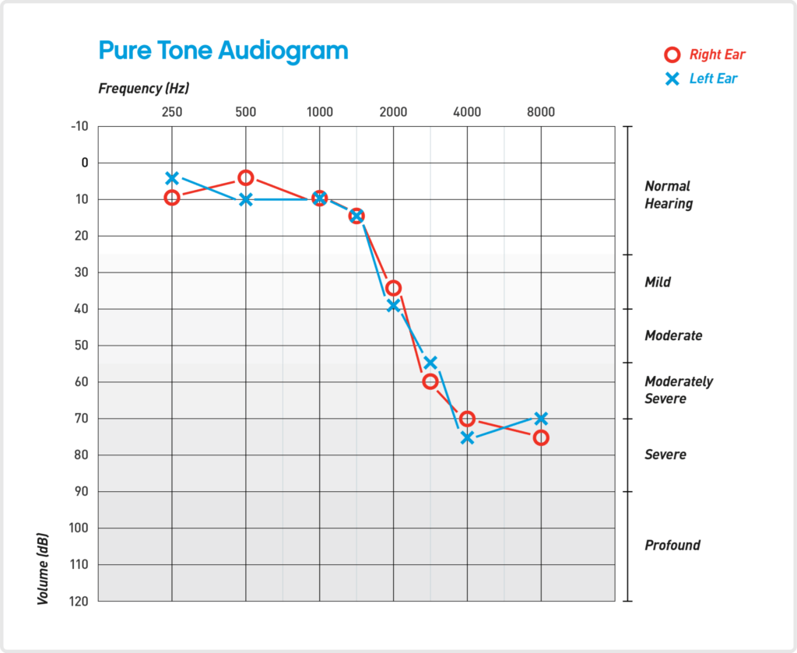

# Sessie 11 & 12: vrije eindopdracht

De laatste twee sessies staan in het teken van een vrije eindopdracht. Het doel is om datgene wat je de afgelopen weken hebt geleerd &mdash; en dat is nogal wat! &mdash; toe te passen op een (bio)medisch onderwerp dat je zelf interessant vindt. Hieronder staan een aantal suggesties, maar je mag ook met een eigen idee komen. Overleg dat dan wel even met de staf, zodat we samen kunnen inschatten of het plan haalbaar is.

Houd er rekening mee dat voor de vrije eindopdracht bijna geen opdrachten klaarliggen. Je zult meer zelf moeten uitzoeken en het kan soms voelen alsof je in het diepe springt. Dat hoort erbij. Werk daarom in kleine stappen, werk deze stappen eerst op papier uit en test je code regelmatig. Probeer niet te veel in één keer te willen doen. En schakel vooral hulp in van assistenten en staf als je even niet verder komt. Het kan zijn dat je na twee sessies merkt dat je onderwerp te ambitieus was. Dat is geen probleem, dat kan nu eenmaal gebeuren bij een vrije opdracht.

Je wordt voor deze opdracht _niet_ beoordeeld. Dat geeft je de ruimte om in een ontspannen sfeer dingen uit te proberen. We hopen dat je met deze eindopdracht ook vertrouwen opbouwt voor de toekomst, dat je bij een volgend vak, of daarbuiten, eerder de stap durft te zetten om een probleem te programmeren als dat het werk makkelijker maakt.

## Van idee naar code

Je kunt de eindopdracht individueel uitvoeren of samen met een medestudent. Werk je samen, dan is het handig om GitHub niet alleen te gebruiken om je bestanden op te slaan, maar ook echt als samenwerkingstool. Door je repository te delen met een medestudent kunnen jullie allebei in dezelfde repository werken. Om conflicten te vermijden is het verstandig om ieder in een eigen bestand te werken. Je kunt elkaars code wel bekijken en overnemen, maar je werkt niet in andermans bestand.[^samenwerken] 

[^samenwerken]: Wil je toch in hetzelfde bestand samenwerken? Dat kan via [branches](https://docs.github.com/en/pull-requests/reference/branches) en [pull requests](https://docs.github.com/en/pull-requests/reference/pull-requests). Vraag de staf om uitleg.

!!! opdracht-basis "Repository aanmaken voor eindopdracht"

    Je gaat een nieuwe repository aanmaken voor de eindopdracht. Als je samen gaat werken in de repository, hoeft maar één van jullie de repository aan te maken.

    1. Zorg dat Visual Studio Code is afgesloten.
    2. Ga naar GitHub Desktop. Kies via het dropdownmenu **File** voor **New repository...**. Geef de reposistory de naam `final-project-BMC` en kies een locatie op je computer. Vink _Initialize this repository with a README_ aan en kies bij _Git ignore_ voor _Python_. Klik daarna op de blauwe knop _Create repository_.
    3. De repository {{github}}`final-project-BMC` is nu aangemaakt en geopend in GitHub Desktop. Klik op _Publish repository_ om de repository op GitHub te zetten. Je kunt de repository privé houden. Als je nu naar [github.com](https://github.com/) gaat zie je bij jouw repositories de zojuist gepubliceerde repository staan. Om wijzigingen ook op GitHub op te slaan, kun je commits pushen met de knop _Push origin_. 

!!! opdracht-basis "Samenwerken via GitHub"

    Voer deze opdracht alleen uit als je samenwerkt met een medestudent. 

    1. Om samen te werken moet je je partner uitnodigen als _collaborator_. Ga naar [github.com](https://github.com) en open de repository {{github}}`final-project-BMC`. Ga naar _Settings_ en kies _Collaborators_. Klik daarna op _Add people_. Zoek je partner op via diens gebruikersnaam of e-mailadres en verstuur de uitnodiging.
    2. Je partner ontvangt een e-mail met een uitnodiging. Zodra die geaccepteerd is, kan je partner de repository clonen via GitHub Desktop. Ga hiervoor naar het dropdownmenu **File** en kies **Clone repository...**. Zoek {{github}}`final-project-BMC` op en kies een locatie op de computer.

    Jullie kunnen nu allebei committen, pushen, fetchen en pullen. Fetch en pull[^fetch-pull] altijd voordat je begint, zodat je de laatste wijzigingen van je partner hebt. Blijf wel werken in je eigen bestand, zodat er geen conflicten ontstaan. Push je werk aan het einde van de sessie of wanneer de ander om een update vraagt.

    [^fetch-pull]: Fetch controleert of er nieuwe wijzigingen op GitHub staan, zonder die wijzigingen al in je lokale bestanden door te voeren. Pull haalt die wijzigingen daarna echt op.

Nu je repository klaarstaat, kun je aan de slag met de eindopdracht. Maar waar begin je? Het helpt om de aanpak eerst goed door te denken voordat je begint met programmeren. De volgende opdracht helpt je daarbij. 

!!! opdracht-basis "Stappenplan"

    1. Verdiep je ter oriëntatie eerst in het onderwerp. Zorg dat je de concepten beter begrijpt. Hoe werkt het? Welke getallen of formules spelen een rol? Maak aantekeningen van wat je denkt nodig te hebben voor je programma.
    2. Schrijf in gewone taal op wat je wilt dat je programma straks doet. Wees concreet: wat moet het programma kunnen?
    3. Verdeel wat je programma moet kunnen in zo klein mogelijke deelstappen. Hoe kleiner de stap, hoe makkelijker het is om dit straks te programmeren. 
    4. Ga na voor welke deelstappen je code kunt hergebruiken uit eerdere opdrachten. Geef daarnaast ook aan voor welke deelstappen je nieuwe code moet schrijven.
    5. Bepaal in welke volgorde je de deelstappen wilt aanpakken. Begin bijvoorbeeld met een deelstap die andere stappen mogelijk maakt, of met iets eenvoudigs om op gang te komen.
    6. Werk de deelstappen één voor één uit. Doe dit eerst op papier en programmeer het daarna. Test elke stap uitgebreid voordat je verder gaat. En vraag om hulp als je vastloopt. Commit na elke werkende stap.

## Suggesties

De onderstaande suggesties zijn gekoppeld aan onderwerpen uit eerdere sessies. Kies er één uit om uit te werken als eindopdracht, of kom met een eigen idee. 

### Audiologie

!!! warning "Gebruik een koptelefoon"

    Gebruik voor deze eindopdracht een koptelefoon. Zo voorkom je dat verschillende geluiden in het lokaal elkaar verstoren. Bovendien kan een koptelefoon lage frequenties, en soms ook hoge frequenties, meestal beter afspelen dan de ingebouwde luidsprekers van een laptop. 

Een _audiogram_ is een grafische weergave van iemands gehoor (zie voorbeeld hieronder[^audiogram]). Het laat voor elke frequentie zien bij welk geluidsniveau iemand een toon nog net kan horen. Op de $x$-as staan de frequenties en op de $y$-as de gehoordrempel in dB HL (_hearing level_). De aanduiding dB HL is een relatieve schaal. 0 dB HL is het geluidsniveau dat voor elke frequentie als referentie is gekozen en geeft de gemiddelde gehoordrempel van mensen met normaal gehoor. Hogere waarden betekenen dat een toon harder aangeboden moet worden voordat iemand hem kan horen. Dus: hoe lager de gehoordrempel, hoe beter het gehoor. Een audiogram wordt vaak voor beide oren apart gemeten.

{: style="width:75%"}

[^audiogram]: [https://www.hear.com/resources/hearing-loss/what-is-audiogram-how-to-read-it/](https://www.hear.com/resources/hearing-loss/what-is-audiogram-how-to-read-it/)

Voor het afnemen en visualiseren van zo'n meting heb je al bouwstenen in handen. Je weet hoe je een toon met een bepaalde frequentie afspeelt en je kunt een plot maken. In de paarse opdrachten [_Fade out_](audiologie.md#opdr:fade-out) en [_Stereo panning_](audiologie.md#opdr:stereo-panning) leer je hoe je het volume van een geluidssignaal aanpast en hoe je met stereogeluid werkt. Met deze bouwstenen zet je de eerste stappen naar een audiogram.

Let op: de $y$-as van een audiogram is een geijkte schaal. 0 dB HL is niet zomaar een getal. Het is voor elke frequentie een nauwkeurig bepaald referentieniveau, gemeten met gekalibreerde apparatuur. Een laptop en koptelefoon leveren geen gekalibreerd geluidsniveau, waardoor je niet dezelfde geijkte schaal kunt gebruiken. Bedenk daarom een eigen schaal. Je kunt bijvoorbeeld de zachtste toon die jij bij elke frequentie nog net kan horen als 0 dB definiëren. Als bovengrens kun je de amplitude van de sinusgolf op 1 zetten en daar de dB-waarde bij uitrekenen. Het resultaat is geen klinisch betrouwbaar audiogram, maar wel een zinvolle visualisatie van iemands gehoor. 
