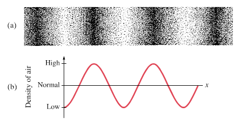

# Sessie 6: audiologie

Tot nu toe hebben we Python-programma's geschreven voor het doorzoeken van data, het maken van berekeningen en het opstellen en simuleren van modellen. In deze sessie schrijven we een Python-programma voor het uitvoeren van een diagnostische test. Zo'n test zouden we ook met de hand kunnen uitvoeren, maar door hem te automatiseren wordt hij sneller, nauwkeuriger en betrouwbaarder. Natuurlijk kost het schrijven van een Python-programma tijd, maar daarna kunnen we hem wel steeds opnieuw gebruiken. 

!!! info "Aansluiting MNW-programma"

    In deze sessie ontwikkelen we een programma voor een eenvoudige hoortest. Daarmee sluit de sessie aan bij het vak _Natuurkunde en gezondheid_ (jaar 1, periode 5), waarbinnen onder andere het vakgebied audiologie aan bod komt. Audiologie richt zich op het gehoor en op gehoorproblemen. Een hoortest is één van de methoden om het gehoor te onderzoeken.
    
## Van sinusgolf naar geluid     

Voor een hoortest hebben we geluid nodig. Geluid is een trilling die zich voortplant als een golf door de lucht. Onderstaand figuur[^giancoli] laat zien hoe een enkele toon zich voortplant als longitudinale golf (a). Een enkele toon is wiskundig te beschrijven als een sinusgolf (b): een periodieke trilling met een vaste frequentie. De frequentie bepaalt de toonhoogte en wordt uitgedrukt in hertz (Hz). Een menselijk oor is gevoelig voor frequenties tussen de 20 Hz en 20.000 Hz, hoewel dit per persoon verschilt. Door ouderdom wordt het bijvoorbeeld lastiger om hoge frequenties te horen.

{: style="width:60%"}

[^giancoli]: Douglas C. Giancoli. _Physics: principles with applications_. 6de ed. Upper Saddle River, New Jersy: Pearson Education, 2005.

We kunnen zelf een sinusgolf genereren en deze met de Python-module `sounddevice` afspelen. De basisstructuur van zo'n programma ziet er als volgt uit: 
```py
import sounddevice as sd

# create a sine wave
# store the sine wave values in a list called values
...

# play the tone and wait until it has finished
sd.play(values, samplerate=44100)
sd.wait()
```
Eerst importeren we de module. Daarna maken we een lijst aan met de waarden van de sinusgolf (dit deel programmeer je later zelf). Met `sd.play()` spelen we de toon af. We geven daarbij de lijst met de waarden van de sinusgolf en een bemonsteringsfrequentie (Engels: sample rate) mee. De bemonsteringsfrequentie geeft aan hoeveel waarden per seconde worden gebruikt bij het afspelen van het signaal. Wij gebruiken een bemonsteringsfrequentie van 44100 Hz, wat een standaardwaarde is in audio. De duur van de toon hangt af van de lengte van de lijst. Bij een bemonsteringsfrequentie van 44100 Hz en een lijst van 44100 elementen duurt de toon precies één seconde. Tot slot zorgt `sd.wait()` ervoor dat het programma wacht totdat de toon volledig is afgespeeld, voordat het verdergaat.

!!! warning "Gebruik een koptelefoon"

    Gebruik tijdens deze sessie een koptelefoon. Zo voorkom je dat verschillende geluiden in het lokaal elkaar verstoren. Bovendien kan een koptelefoon lage frequenties, en soms ook hoge frequenties, meestal beter afspelen dan de ingebouwde luidsprekers van een laptop. Daardoor kun je de grenzen van je gehoor beter bepalen. Houd er wel rekening mee dat ook koptelefoons een beperkt frequentiebereik kunnen hebben. Als je een lage of hoge toon niet hoort, ligt dat mogelijk aan de koptelefoon.

!!! opdracht-basis "Module `sounddevice` installeren"

    Om de module `sounddevice` te kunnen gebruiken, moet je deze eerst installeren in de virtuele omgeving. Open in Visual Studio Code een terminal via het dropdownmenu **Terminal** en kies **New Terminal**. Installeer vervolgens de module met:
    ```
    uv pip install sounddevice
    ```
    
!!! opdracht-basis "Toon afspelen"

    Je schrijft een programma dat een toon van 1000 Hz genereert en afspeelt.

    1. Maak een nieuw bestand aan met de naam {{new_file}}`play_tone.py` en importeer daarin de module `sounddevice`. Definieer bovenaan in het bestand de frequentie van 1000 Hz en maak een lege lijst `values` aan om de waarden van de sinusgolf in op te slaan. 
    2. Schrijf een for-loop om de lijst `values` te vullen met 44100 elementen van een sinusgolf, zodat de toon één seconde duurt. Commit.
    3. Speel de toon af en controleer of je de toon hoort. 
    4. Zorg ervoor dat het programma de frequentie print van de toon die wordt afgespeeld. Bijvoorbeeld: `Playing a tone of 1000 Hz.` Zet het print-statement vóór het afspelen van de toon. Controleer of je programma zowel print als de toon afspeelt. Commit.

!!! opdracht-basis "Spelen met geluid"

    1. Nu je een toon van 1000 Hz kunt afspelen, kun je ook andere tonen afspelen. Pas de frequentie aan en controleer of je een andere toonhoogte hoort. 
    2. De toon die je afspeelt duurt nu één seconde. Pas je code aan om een toon van twee seconden af te spelen. Doe dit daarna ook voor vijf seconden en voor tien seconden.

!!! opdracht-basis "Quick-'n-dirty hoortest"

    Probeer met behulp van je programma te achterhalen wat de laagste en de hoogste frequentie is die je nog kunt horen. 

!!! opdracht-meer "Fade out"

    Je kunt natuurlijk het volume van de toon aanpassen via de instellingen van je laptop. Maar je kunt de toon ook zachter of harder maken door de amplitude van het signaal aan te passen. 
    
    1. Maak een nieuw bestand aan met de naam {{new_file}}`fade_out.py` en kopieer je code uit het bestand {{file}}`play_tone.py` naar dit bestand. 
    2. Pas de code aan zodat de amplitude van de sinusgolf geleidelijk afneemt naar nul. Commit.

!!! opdracht-meer "Stereo panning"

    Bij een gehoortest wil je soms het linker- en het rechteroor apart testen. Met stereogeluid kun je een toon aan één oor aanbieden door het signaal alleen via de linker- of rechterluidspreker af te spelen. 

    De module `sounddevice` ondersteunt stereogeluid. Je geeft dan `sd.play()` een lijst mee waarin elk element bestaat uit twee waarden: één voor het linkerkanaal en één voor het rechterkanaal. Om het signaal alleen links af te spelen, zet je de rechterwaarde op nul: 
    ```python
    values_left.append([value, 0])
    ```
    Om het signaal alleen rechts af te spelen, zet je de linkerwaarde op nul. 

    1. Maak een nieuw bestand aan met de naam {{new_file}}`stereo_panning.py` en kopieer je code uit het bestand {{file}}`play_tone.py` naar dit bestand. 
    2. Maak nu twee aparte lijsten: één voor alleen links en één voor alleen rechts. Speel beide tonen daarna af. Print vóór het afspelen de frequentie en via welke luidspreker de toon wordt afgespeeld. Commit.

## Strategie voor de hoortest

Om een hoortest uit te voeren, hebben we een slimme strategie nodig. Een hoortest moet namelijk niet alleen betrouwbaar zijn, maar ook zo kort mogelijk duren. Elke toon kost immers tijd en vraagt aandacht van de patiënt. Met een slimme strategie kunnen we de gehoordrempel efficiënt bepalen. Computers kunnen zulke vaste stappen systematisch uitvoeren. Voordat we deze stappen programmeren, onderzoeken we eerste welke strategie het efficiënst is om een onbekende waarde te vinden.

In de volgende opdracht gebruiken we een vereenvoudigd situatie. De gehoordrempel ligt in deze opdracht al vast, terwijl een patiënt in een echte hoortest zelf aangeeft of een toon hoorbaar is. Door de situatie te vereenvoudigen, kunnen we verschillende strategieën goed met elkaar vergelijken. 

!!! opdracht-basis "Slim zoeken"

    Stel je voor dat je audioloog bent. De patiënt heeft een onbekende gehoordrempel tussen 0 en 100. Je mag steeds één getal voorstellen. De patiënt vertelt alleen of de werkelijke drempel **hoger**, **lager** of **gelijk aan** jouw voorstel is. Hoe vind je de gehoordrempel met zo weinig mogelijk vragen?

    1. Werk in een klein groepje. Bedenk meerdere strategieën om een onbekend geheel getal tussen 0 en 100 snel te vinden. 
    2. Bespreek de bedachte strategieën met de gehele groep. Noteer de verschillende strategieën op een whiteboard.
    3. Beslis als groep welke strategieën jullie willen testen en verdeel deze over de groepjes.
    4. Werk weer in het kleine groepje. Jullie testen de toegewezen strategie met vijf onbekende getallen tussen 0 en 100. Ieder groepje gebruikt dezelfde vijf getallen, zodat jullie de resultaten straks eerlijk kunnen vergelijken. Wijs binnen het groepje de volgende rollen toe: 
        
        **Patiënt**: trekt aan het begin van een ronde een kaartje met het geheime getal. De patiënt mag dit getal niet met de rest van het groepje delen. De patiënt beantwoordt vragen van de audioloog alleen met _hoger_, _lager_ of _gelijk aan_. 
    
        **Audioloog**: stelt getallen voor op basis van de toegewezen strategie. De audioloog doet dit net zo lang totdat het geheime getal gevonden is. 
        
        **Notulist**: houdt alle voorgestelde getallen en antwoorden bij.
    
        Stop zodra het geheime getal is gevonden. Wissel daarna van rol, zodat iedereen minimaal één keer in elke rol aan de beurt is geweest.
    5. Nadat jullie alle rondes doorlopen hebben, tel je voor elke ronde het aantal vragen dat nodig was. Bereken daarna het gemiddelde, het minimum en het maximum aantal vragen. Schrijf deze waarden op het whiteboard.
    6. Vergelijk de resultaten van de verschillende strategieën. Welke strategie heeft gemiddeld de minste vragen nodig? Hoe verklaar je dat?
