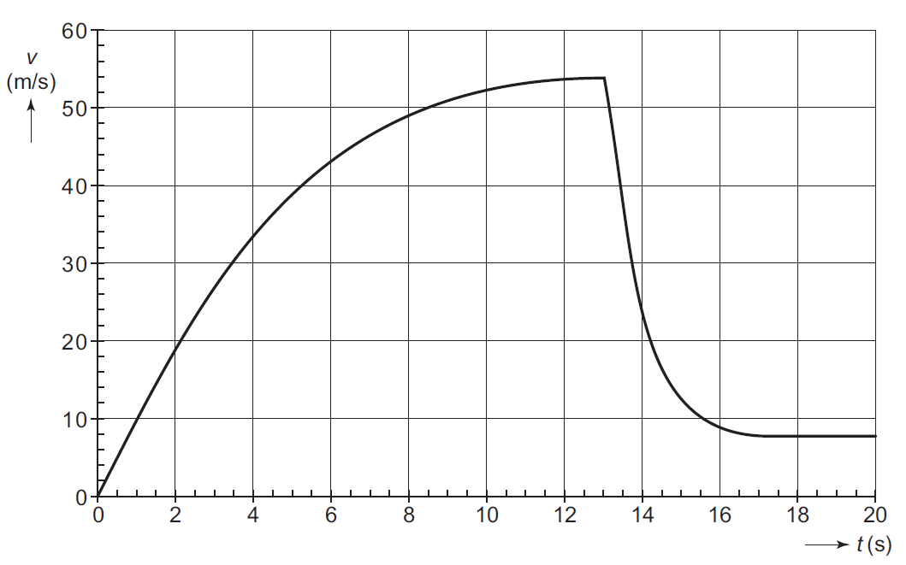

# Modelleren en simuleren

In de voorgaande sessies hebben we al gezien dat programmeren handig kan zijn voor bepaalde problemen. In deze sessie gaan we dieper in op een toepassing die je waarschijnlijk al kent: het modelleren van verschijnselen. Grote kans dat je op de middelbare school modellen gemaakt hebt in Coach.[^coach] En ook bij het huidige natuurkunde practicum gebruik je modellen om een verschijnsel te beschrijven, bijvoorbeeld om een verwachting op te stellen of je resultaten te interpreteren. 

[^coach]: [https://cma-science.nl/coach7_nl/](https://cma-science.nl/coach7_nl/)

Maar wat bedoelen we nu eigenlijk met de woorden *modelleren* en *simuleren*? Een model is een vereenvoudigde weergave van de werkelijkheid. Je beschrijft een verschijnsel met formules, waarbij je keuzes maakt over wat je wel en niet meeneemt in het model. Een model dat alles probeert te beschrijven, wordt al snel te complex om mee te werken.[^aanname] Bij een simulatie gebruik je zo'n model om situaties door te rekenen. Door parameters aan te passen, kun je onderzoeken hoe een uitkomst verandert. Dit maakt het mogelijk om situaties te testen die in het echt moeilijk of onmogelijk uit te voeren zijn, zoals het simuleren van een epidemie.

[^aanname]: Stel je modelleert een vallend voorwerp. In werkelijkheid speelt luchtwrijving een rol, maar die bijdrage is vaak verwaarloosbaar klein. In het model neem je daarom de luchtwrijving niet mee. Niet omdat je het effect vergeet, maar omdat het model anders onnodig ingewikkeld wordt.

Een computer is bij uitstek geschikt voor modelleren en simuleren. Berekeningen die met de hand onpraktisch zijn[^Zuiderzee], voert een computer een stuk sneller uit. En je kunt eenvoudig verschillende situaties vergelijken door een parameter te veranderen.

[^Zuiderzee]: Een historisch voorbeeld: natuurkundige Hendrik Antoon Lorentz leidde van 1918 tot 1926 de Staatscommissie Zuiderzee, die de effecten van een afsluitdijk op de waterstanden moest berekenen.[^verslag] En dit gebeurde volledig met de hand, een enorme klus zonder computer!
[^verslag]: [https://www.lorentz.leidenuniv.nl/history/zuiderzee/zuiderzee.html](https://www.lorentz.leidenuniv.nl/history/zuiderzee/zuiderzee.html)

## Parachutesprong

In deze sessie modelleren we de concentratie van een medicijn in het bloed. Maar eerst oefenen we met een kleinere opdracht: een parachutesprong. Dit doen we aan de hand van een examenopgave uit 2005.[^champignon]

[^champignon]: [https://natuurkundeuitgelegd.nl/examenopgaven.php?examenopgave=champignon](https://natuurkundeuitgelegd.nl/examenopgaven.php?examenopgave=champignon)

Hannes Arch is de eerste mens die een parachutesprong waagde van de Champignon, een 1800 meter hoge rots aan de noordwand van de Eiger in Zwitserland. We maken een model om het verloop van zijn snelheid tijdens de parachutesprong te benaderen. In dit model nemen we luchtweerstand wél mee. Voor de luchtwaarstand geldt
\begin{equation}
F_w = k \cdot A \cdot v^2.
\end{equation}
Hierin is $k$ een constante waarvan de waarde geschat wordt op $0.37 \text{ kg} \, \text{m}^{-3}$, $A$ het frontale oppervlak van de parachutist inclusief parachute in $\text{m}^2$ en $v$ de snelheid in $\text{m} \, \text{s}^{-1}$.

De massa van Hannes mét parachute is 91 kg. Zolang de parachute nog niet is geopend, is het frontale oppervlak $0.80 \text{ m}^2$. Na 13 s opent Hannes zijn parachute. De parachute ontvouwt zich geleidelijk in $3.8 \text{ s}$ tot een frontale oppervlak van $42.6 \text{ m}^2$. Tijdens het openen van de parachute neemt het frontale oppervlak lineair toe in de tijd.

!!! opdracht-basis "(Ver)ken je probleem"
    Voordat je gaat programmeren, is het handig om eerst het probleem te verkennen, zodat je straks houvast hebt. Doe dit op papier en overleg vooral ook met een buurmens.

    1. Maak een overzicht van alle constante grootheden en hun waarden.
    2. De sprong bestaat uit drie fases. Beschrijf elke fase, geef de bijbehorende tijdsgrenzen en het frontale oppervlak.
    3. Schrijf op welke vergelijkingen je nodig hebt om de snelheid op een tijdstip te berekenen. Gelden deze vergelijkingen voor alle fases of verschillen ze per fase? 

Het is de bedoeling om het verloop van de snelheid tijdens de parachutesprong in de eerste $20 \text{ s}$ te programmeren met tijdstappen van $0.1 \text{ s}$. Om het programmeren overzichtelijk te houden, programmeer je stap voor stap en test je je code regelmatig. Zo blijven de stappen behapbaar en houd je controle.

!!! opdracht-basis "Vrije val"

    1. Maak een nieuw bestand aan met de naam {{new_file}}`base_jumping.py`. Definieer bovenaan in het bestand alle constante grootheden, zie [_opdracht (Ver)ken je probleem_](#opdr:verken-probleem).
    2. Bereken de snelheid voor alle tijdstappen in de eerste fase, de fase waarin de parachute nog niet is geopend. Maak een plot waarin je de snelheid $v$ uitzet tegen de tijd $t$. Test je code. Komt de plot overeen met wat je verwacht? Commit.
    3. Bereken nu ook de snelheid voor alle tijdstappen in de tweede fase, de fase waarin de parachute zich geleidelijk ontvouwt. Breid de plot uit met deze fase. Test je code. Komt de plot overeen met wat je verwacht? Commit.
    4. Bereken nu ook de snelheid voor alle tijdstappen in de laatste fase, de fase waarin de parachute volledig geopend is. Maak een plot van álle fases. Test je code. Komt de plot overeen met wat je verwacht? Commit.

Volgens de examenopgave zou het $v,t$-diagram er als volgt uit moeten zien.[^champignon] Komt jouw plot overeen met dit diagram?
{: style="width:60%"}

!!! opdracht-meer "Wat als?"
    Nu je een model gemaakt hebt, kun je gaan kijken wat er gebeurt als je een parameter aanpast. Kies één van de onderstaande situaties en plot de verschillende scenario's in één grafiek. 

    1. Hannes Arch weegt met parachute 91 kg. Hoe verandert het $v,t$-diagram voor een parachutespringer met meer of minder massa?
    2. Hoe verandert het $v,t$-diagram wanneer de parachute minder goed ontvouwt en het frontale oppervlak kleiner is? 
 
!!! warning
    Nog een meer leren opdracht nodig.

## Medicijnconcentratie in het bloed

XXX

!!! warning
    Nieuwe Python constructen waarvoor (mogelijk) verwijzing naar appendix nodig is:

    1. Plotten
    2. Horizontale lijn in plot tekenen
    3. Importeren modules (of zit deze al in sessie 3?)
    4. ImportError (of zit deze al in sessie 3?)